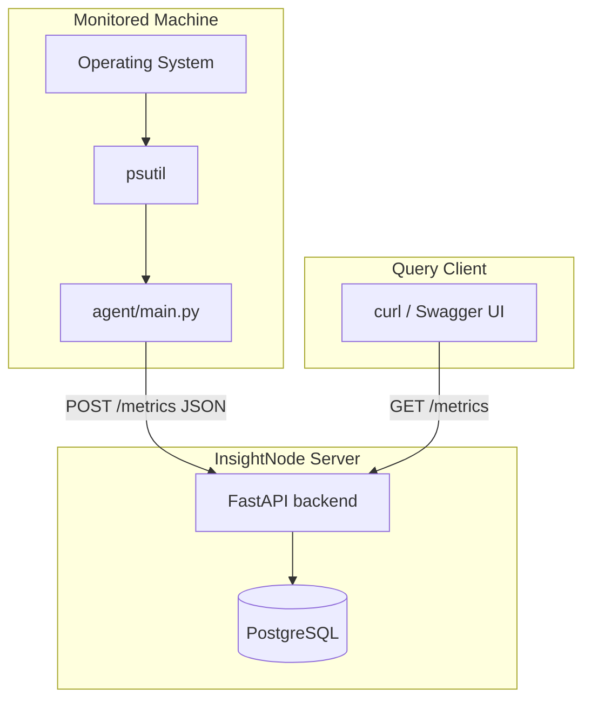

# Architecture — Phase 1 (Week 1)

## Purpose

InsightNode Phase 1 is a **minimal observability pipeline** for learning:

1. What telemetry is (gauges, timestamps, structured payloads)
2. How data flows from host → API → database
3. Why a simple synchronous design breaks at scale

This is intentionally **not** production-ready. Complexity is added only when we hit the problem that requires it.

---

## High-level architecture



---

## Components

### 1. Telemetry Agent (`agent/main.py`)

| Responsibility | Detail |
|----------------|--------|
| **Collect** | CPU, memory, disk via `psutil` every 5 seconds |
| **Structure** | JSON payload with `machine_id`, `timestamp`, `metrics[]` |
| **Emit** | HTTP POST to `http://127.0.0.1:8000/metrics` |

**Design decisions:**

- **`machine_id`** = hostname (`socket.gethostname()`) — unique per machine without config
- **`timestamp`** = UTC ISO 8601 — required for multi-machine alignment later
- **Metrics are gauges** — instantaneous values that go up and down (not counters)
- **Push model** — agent sends data; server does not scrape

**Comparison:** Datadog Agent collects host metrics and pushes to intake. Prometheus `node_exporter` exposes metrics and Prometheus **pulls** them. We use push because it's simpler to reason about when learning.

### 2. Ingestion + Query API (`backend/main.py`)

| Endpoint | Method | Role |
|----------|--------|------|
| `/health` | GET | Liveness check |
| `/metrics` | POST | Validate payload → INSERT rows → 201 |
| `/metrics` | GET | Filter by machine, metric, time → JSON response |

**Stack:**

- **FastAPI** — HTTP routing, auto-generated OpenAPI docs
- **Pydantic** — request validation (422 on bad input)
- **SQLAlchemy 2.0** — ORM for PostgreSQL access

**Design decisions:**

- **One row per metric point** — 1 payload with 3 metrics → 3 INSERT rows
- **Synchronous writes** — API blocks until `db.commit()` succeeds
- **Query limit default 100** — prevents unbounded result sets

### 3. PostgreSQL (`sql/schema.sql`)

| Responsibility | Detail |
|----------------|--------|
| **Store** | All metric points in append-only `metrics` table |
| **Index** | Time-range and machine+metric+time queries |

**Why PostgreSQL for Phase 1:**

- Familiar SQL, easy local setup
- ACID transactions — insert all-or-nothing per payload
- Good enough for 1 machine, breaks visibly at thousands

**Why not PostgreSQL forever:** Row-based storage and per-request commits are inefficient for billions of time-series points. Phase 3 introduces ClickHouse.

---

## Data model (logical)

```
MetricsPayload (HTTP JSON)
├── machine_id: string
├── timestamp: datetime (UTC)
└── metrics: array
    └── { name, value, unit }

        ↓ normalized to ↓

metrics table (PostgreSQL)
├── id (auto)
├── machine_id
├── metric_name
├── value
├── unit
├── timestamp      ← when agent measured
└── created_at     ← when server stored
```

---

## Metric types collected (Week 1)

| Name | Type | Source | Unit |
|------|------|--------|------|
| `cpu_usage` | Gauge | `psutil.cpu_percent(interval=5)` | percent |
| `memory_usage` | Gauge | `psutil.virtual_memory().percent` | percent |
| `disk_usage` | Gauge | `psutil.disk_usage('/').percent` | percent |

---

## Deployment model (local dev)

All components run on one machine (your Mac):

| Process | Port | Command |
|---------|------|---------|
| PostgreSQL | 5432 | `brew services start postgresql@16` |
| FastAPI | 8000 | `uvicorn backend.main:app --reload --port 8000` |
| Agent | — | `python agent/main.py` |

In production, the agent runs on **every monitored host**; the API and database run on **central server(s)**.

---

## What Phase 1 deliberately omits

| Missing | Why omitted | When added |
|---------|-------------|------------|
| Message queue | No scale pain yet | Phase 2 (Redis/Kafka) |
| Batch writes | 1 machine is fine | Phase 2 |
| Agent retry buffer | Seen data loss, not fixed yet | Phase 2 (Day 8–9) |
| ClickHouse | Postgres works at this scale | Phase 3 |
| Auth / API keys | Single user learning | Phase 6 |
| Dashboards | Query API is enough for now | Week 5+ |

---

## Key design tradeoffs

| Choice | Benefit | Cost |
|--------|---------|------|
| Sync POST → commit | Simple, easy to debug | Slow under load; agent blocks |
| Push agent | Works behind NAT | Server can't control scrape interval |
| One row per metric | Easy SQL queries | 3× rows vs one JSON blob |
| PostgreSQL | Familiar, transactional | Not optimized for TSDB workloads |
| No queue | Minimal infrastructure | Data loss on failure |
