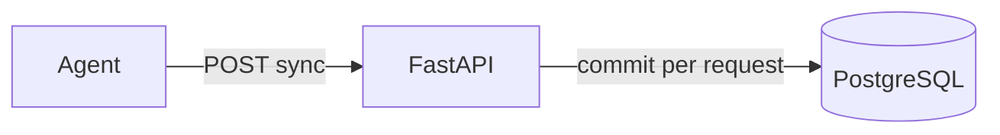
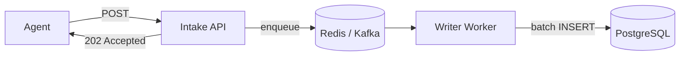

# Known Bottlenecks & Roadmap

## Why Phase 1 does not scale

Phase 1 is **correct for learning** and **incorrect for production** at scale. This document captures what breaks, in what order, and what Phase 2+ introduces to fix it.

---

## Scale math

### 1 machine (current)

| Metric | Value |
|--------|-------|
| Payloads per day | 17,280 (every 5s) |
| Rows per day | 51,840 (3 metrics each) |
| Writes per second | ~0.6 |

### 1,000 machines

| Metric | Value |
|--------|-------|
| Rows per day | ~52 million |
| Writes per second | ~600 |
| Disk per day | ~5 GB |

### 10,000 machines

| Metric | Value |
|--------|-------|
| Rows per day | ~518 million |
| Writes per second | ~6,000 |
| Disk per day | ~50 GB |

---

## Bottleneck ranking

What breaks first with 1,000 machines at 5-second intervals:

| Priority | Bottleneck | Symptom | Root cause |
|----------|------------|---------|------------|
| **1** | Synchronous PostgreSQL writes | API latency spikes; agents timeout | Every POST waits for `commit()` + index update |
| **2** | No agent buffer / retry | Data loss on any blip | Agent logs error and drops payload |
| **3** | Single API process blocked on DB | Request queue grows | Ingest throughput = DB write throughput |
| **4** | Query performance | Slow dashboards | Table grows to hundreds of millions of rows |
| **5** | Disk / retention | Disk fills | No TTL or archival policy |
| **6** | No backpressure | Cascading failures | Agents keep sending when server is overloaded |

### Already observed (1 machine)

- `[ERROR] Connection refused` when backend was down → **6 payloads lost per 30s outage**
- Agent continues but data is gone — no recovery

---

## Architecture diagram: today vs Phase 2

### Today (Phase 1) — synchronous, coupled

**Problem:** Ingest rate = storage rate. No buffer. No retry.

### Phase 2 target — async, decoupled

**Fixes:** Fast intake, durable queue, batch writes, independent scaling.

---

## Known limitations (checklist)

### Agent

- [ ] No retry on HTTP failure
- [ ] No local buffer (disk/memory queue)
- [ ] No idempotency keys (retries would duplicate rows)
- [ ] Hardcoded API URL
- [ ] No authentication

### API

- [ ] Synchronous DB write on every request
- [ ] No connection pooling configuration
- [ ] `/health` does not check database
- [ ] No rate limiting
- [ ] Single process (no horizontal scaling story yet)

### Database

- [ ] PostgreSQL not optimized for time-series at billions of rows
- [ ] No retention / TTL policy
- [ ] No partitioning by time
- [ ] No read replicas
- [ ] No unique constraint for deduplication

### Query

- [ ] No aggregation API (AVG, MAX over intervals)
- [ ] No downsampling for long time ranges
- [ ] Raw points only — charts may need thousands of points

---

## How real systems solve this

| Problem | Prometheus | Datadog | InsightNode Phase 2+ |
|---------|------------|---------|----------------------|
| Data loss | Stateless exporter; miss scrape | Agent buffer + retry | Agent buffer + retry (Day 8–9) |
| Write throughput | Local TSDB, batch compaction | Queue + columnar store | Redis/Kafka + batch writer (Day 11–14) |
| Storage at scale | Custom TSDB | Custom columnar | ClickHouse (Phase 3) |
| Query performance | PromQL + TSDB indexes | Pre-aggregated + columnar | ClickHouse + aggregations |
| Logs | N/A (separate stack) | Unified platform | OpenSearch (Phase 4) |
| Traces | N/A | APM pipeline | OpenTelemetry + Jaeger (Phase 5) |
| Multi-tenant | Federation | Tenant isolation + API keys | Phase 6 |

---

## Roadmap

### Week 1 ✅ — Phase 1: Sync pipeline

- [x] Telemetry agent
- [x] FastAPI ingestion + validation
- [x] PostgreSQL storage + indexes
- [x] Query API
- [x] Architecture review
- [x] Documentation

### Phase 2 — Queues & async (Days 8–17)

| Day | Topic |
|-----|-------|
| 8 | Agent retries + exponential backoff |
| 9 | Agent local buffer |
| 10 | Idempotency + unique constraints |
| 11 | Redis queue |
| 12 | API returns 202, enqueues only |
| 13 | Worker: consume → batch INSERT |
| 14 | Batching tuning |
| 15 | Backpressure |
| 16 | Kafka |
| 17 | Redis vs Kafka comparison + docs |

### Phase 3 — ClickHouse (Days 18–23)

Time-series storage, compression, TTL, Postgres vs ClickHouse benchmarks.

### Phase 4 — OpenSearch (Days 24–29)

Structured logs, full-text search, correlation with metrics.

### Phase 5 — Tracing (Days 30–35)

OpenTelemetry, Jaeger, three pillars of observability.

### Phase 6 — SaaS concepts (Days 36–42)

Multi-tenancy, API keys, rate limiting, usage metering, sharding design.

### Product features (Days 43–50)

Grafana dashboards, alerting, end-to-end demo.

---

## Design questions answered (Week 1)

**Q: Why push instead of pull?**  
A: Simpler agent model for learning. Datadog uses push; Prometheus uses pull. Both valid.

**Q: Why one row per metric instead of JSONB blob?**  
A: Enables efficient SQL filtering by `metric_name` and time range.

**Q: Why PostgreSQL first?**  
A: Experience the bottleneck before introducing specialized tools — intentional pedagogical path.

**Q: Why not fix scale issues in Week 1?**  
A: You must feel data loss and understand sync commit cost before queues make sense.

---

## Success criteria for Phase 1

Phase 1 is complete when you can:

1. Explain the full request flow from psutil to PostgreSQL row
2. Calculate rows/day for N machines
3. Name the top 3 bottlenecks and their fixes
4. Run agent + API + query end-to-end locally
5. Point to where Datadog/Prometheus solve the same problems differently

**All five are met — Phase 1 complete. Proceed to Phase 2.**
