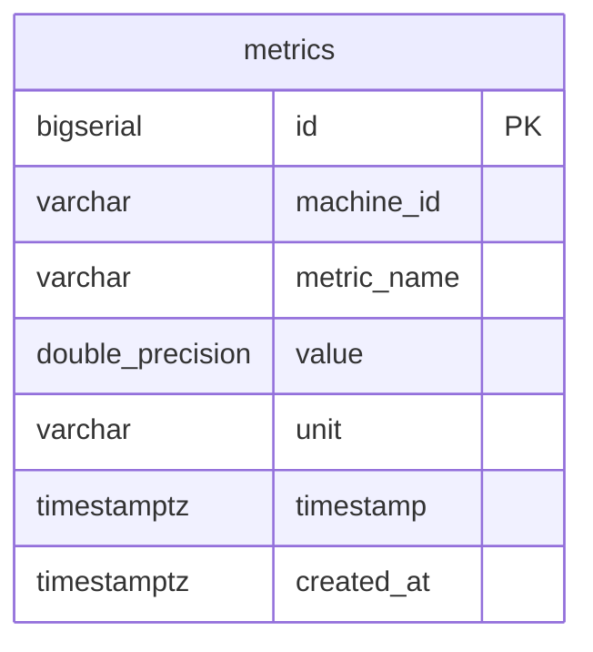

# Database Schema — Phase 1

## Overview

Phase 1 uses a single PostgreSQL table: **`metrics`**.

Design principles:

- **Append-only** — INSERT only; never UPDATE historical readings
- **One row per metric point** — normalized for SQL filtering
- **UTC timestamps** — `TIMESTAMPTZ` stores absolute time
- **Indexes match query patterns** — machine + metric + time range

---

## Entity relationship

Phase 1 has no foreign keys — flat time-series table:



---

## Table: `metrics`

```sql
CREATE TABLE metrics (
    id          BIGSERIAL PRIMARY KEY,
    machine_id  VARCHAR(255) NOT NULL,
    metric_name VARCHAR(255) NOT NULL,
    value       DOUBLE PRECISION NOT NULL,
    unit        VARCHAR(50) NOT NULL,
    timestamp   TIMESTAMPTZ NOT NULL,
    created_at  TIMESTAMPTZ NOT NULL DEFAULT NOW()
);
```

### Column reference

| Column | Type | Purpose |
|--------|------|---------|
| `id` | BIGSERIAL | Surrogate primary key — internal only, not exposed in API |
| `machine_id` | VARCHAR(255) | Source host identifier (hostname) |
| `metric_name` | VARCHAR(255) | Metric identifier (`cpu_usage`, `memory_usage`, `disk_usage`) |
| `value` | DOUBLE PRECISION | Numeric reading at sample time |
| `unit` | VARCHAR(50) | Unit of measure (`percent`) |
| `timestamp` | TIMESTAMPTZ | **When the agent measured** the value |
| `created_at` | TIMESTAMPTZ | **When the server stored** the row (defaults to `NOW()`) |

### Why two timestamps?

| Field | Meaning | Example use |
|-------|---------|-------------|
| `timestamp` | Agent sample time | Graphs, alerts, queries |
| `created_at` | Server ingest time | Detecting agent lag or offline periods |

If an agent was offline for 10 minutes and retried (Phase 2), `timestamp` would be old but `created_at` would be recent — useful for debugging pipeline delay.

---

## Indexes

```sql
CREATE INDEX idx_metrics_timestamp
    ON metrics (timestamp);

CREATE INDEX idx_metrics_machine_metric_time
    ON metrics (machine_id, metric_name, timestamp);
```

### Index 1: `idx_metrics_timestamp`

**Supports:** Broad time-range scans across all machines/metrics.

```sql
SELECT * FROM metrics
WHERE timestamp >= '2026-06-14 19:00:00+00'
  AND timestamp <= '2026-06-14 20:00:00+00';
```

### Index 2: `idx_metrics_machine_metric_time` (primary query index)

**Supports:** Dashboard query pattern — one metric, one machine, time range.

```sql
SELECT * FROM metrics
WHERE machine_id = 'Jayakrishnans-MacBook-Air.local'
  AND metric_name = 'cpu_usage'
  AND timestamp >= '2026-06-14 19:00:00+00'
  AND timestamp <= '2026-06-14 20:00:00+00'
ORDER BY timestamp ASC
LIMIT 100;
```

**Why column order matters:** PostgreSQL uses composite indexes left-to-right. `(machine_id, metric_name, timestamp)` efficiently narrows to one machine, then one metric, then a time slice.

---

## Append-only model

### What we do

```sql
INSERT INTO metrics (machine_id, metric_name, value, unit, timestamp)
VALUES ('host-1', 'cpu_usage', 45.2, 'percent', '2026-06-14T10:00:00+00:00');
```

Every 5 seconds → 3 new rows. History is preserved.

### What we don't do

```sql
-- NEVER for time-series metrics:
UPDATE metrics SET value = 50.0 WHERE machine_id = 'host-1' AND metric_name = 'cpu_usage';
```

Updating would destroy the time series. Observability platforms treat each point as an immutable event.

### Deletes (future)

Data is removed only via **retention policies** (Phase 3+):

```sql
-- Example future retention (not implemented yet)
DELETE FROM metrics WHERE timestamp < NOW() - INTERVAL '30 days';
```

---

## Write volume (1 machine)

```
3 metrics × 12 payloads/min × 60 min × 24 hr = 51,840 rows/day
```

At ~100 bytes/row (data + index overhead): **~5 MB/day** for one machine.

---

## Example queries

```sql
-- Total rows
SELECT COUNT(*) FROM metrics;

-- Breakdown by metric
SELECT metric_name, COUNT(*) FROM metrics GROUP BY metric_name;

-- Latest CPU reading
SELECT value, timestamp
FROM metrics
WHERE metric_name = 'cpu_usage'
ORDER BY timestamp DESC
LIMIT 1;

-- Average CPU over last hour
SELECT ROUND(AVG(value)::numeric, 2) AS avg_cpu
FROM metrics
WHERE metric_name = 'cpu_usage'
  AND timestamp >= NOW() - INTERVAL '1 hour';

-- Check index usage
EXPLAIN ANALYZE
SELECT * FROM metrics
WHERE machine_id = 'Jayakrishnans-MacBook-Air.local'
  AND metric_name = 'cpu_usage'
ORDER BY timestamp DESC
LIMIT 100;
```

Look for `Index Scan using idx_metrics_machine_metric_time` in the output.

---

## Schema evolution (future)

| Change | Phase | Notes |
|--------|-------|-------|
| Unique constraint on `(machine_id, metric_name, timestamp)` | Phase 2 | Idempotent retries |
| `tenant_id` column | Phase 6 | Multi-tenancy |
| Tags JSONB column | Phase 2+ | `{ "env": "prod", "region": "us-east" }` |
| Move metrics to ClickHouse | Phase 3 | PostgreSQL kept for metadata or removed |
| Partition by time | Phase 3+ | Monthly partitions for retention |
