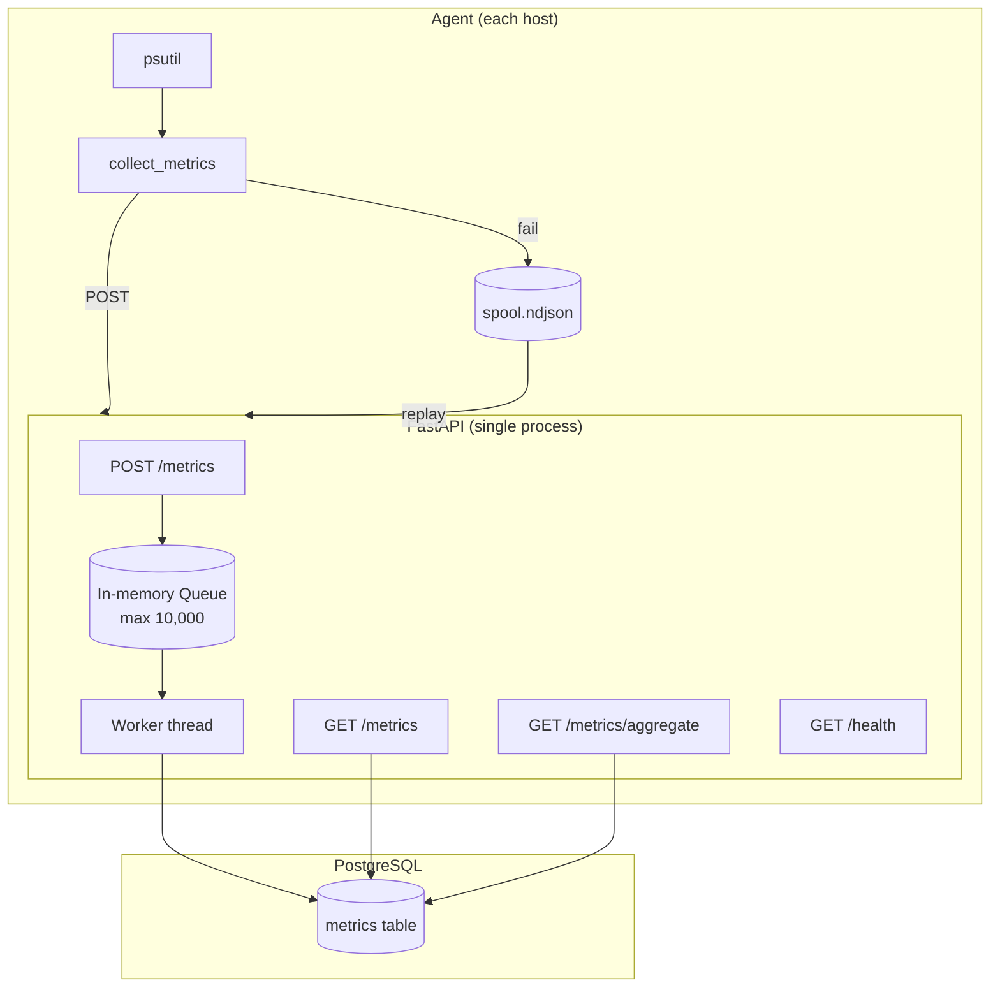

# Phase 1 Architecture — Agent → API → PostgreSQL

Phase 1 implements a **push-based metrics pipeline**: a local agent samples host gauges, sends them to a FastAPI API, buffers them in an in-memory queue, and persists them to PostgreSQL via a background worker.

**Stack:** Python, FastAPI, PostgreSQL only. No Redis, Kafka, ClickHouse, or Kubernetes.

---

## System context



---

## Components

| Component | Location | Responsibility |
|-----------|----------|----------------|
| **Agent** | `agent/main.py` | Sample CPU, memory, disk every ~5s; POST to API |
| **Spool** | `agent/spool.py` | NDJSON disk buffer when API is unreachable |
| **API** | `backend/main.py` | Validate payloads, enqueue, query, health |
| **Worker** | `backend/worker.py` | Batch dequeue → idempotent INSERT to PostgreSQL |
| **Database** | PostgreSQL `metrics` | Append-only time-series storage |

---

## Design decisions

| Decision | Choice | Why |
|----------|--------|-----|
| Collection model | **Push** (agent → API) | Agents behind NAT can report without being scraped |
| Ingest response | **202 Accepted** | Data is queued, not yet in PostgreSQL when response returns |
| Storage coupling | **Decoupled** (queue + worker) | HTTP accept latency independent of DB commit time |
| Metric types | **Gauges** (CPU %, memory %) | Current value, not cumulative counters |
| Timestamps | **UTC ISO 8601** | Unambiguous across hosts and regions |
| Idempotency | **`event_id` UUID** per collection | At-least-once delivery without duplicate rows |
| Aggregation | **Query-time GROUP BY** | Simple for Phase 1; rollups/ClickHouse come later |

---

## Delivery guarantee

```
Transport:  at-least-once  (retries + spool replay may re-send)
Storage:    idempotent     (ON CONFLICT DO NOTHING on event_id)
Effect:     no duplicate rows in PostgreSQL for the same event
```

This is the standard production pattern. True end-to-end exactly-once is rare; idempotent writes achieve the same practical outcome.

---

## API surface

| Endpoint | Purpose |
|----------|---------|
| `POST /metrics` | Ingest — validate, enqueue, return 202 |
| `GET /metrics` | Raw point query with filters |
| `GET /metrics/aggregate` | Time-bucketed avg/min/max/count |
| `GET /health` | Queue depth, worker liveness |

---

## What Phase 2 changes

Phase 1 uses `queue.Queue` inside the API process. Phase 2 replaces it with **Redis**:

- Survives API process restarts
- Enables multiple API instances
- Teaches durable buffering and external decoupling

See [bottlenecks-and-roadmap.md](./bottlenecks-and-roadmap.md) for why this becomes necessary.
