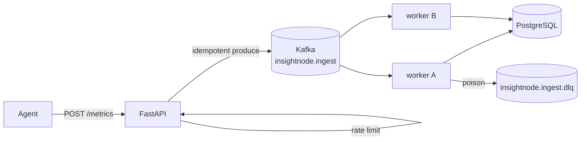

# Phase 2 Architecture

Phase 2 evolves the ingest buffer from an in-process queue to a durable, scalable log.

```
Phase 1:  Agent → API → queue.Queue → worker thread → PostgreSQL
Day 1:    Agent → API → Redis List → worker thread → PostgreSQL
Day 2:    Agent → API → Redis Stream (XACK) → worker → PostgreSQL
Day 3:    Agent → API → Redis Stream → standalone worker process(es)
Day 4:    + Dead Letter Queue for poison messages
Day 5:    Agent → API → Kafka topic → worker group → PostgreSQL (+ Kafka DLQ)
Day 6:    + idempotent producer, /pipeline lag, ingest rate limits  ← YOU ARE HERE
```

---

## Current architecture (Day 6)



| Layer | Technology | Lesson |
|-------|------------|--------|
| Edge backpressure | HTTP 429 rate limit | Protect pipeline from runaway agents |
| Bus backpressure | HTTP 503 on high lag | Workers falling behind |
| Durable log | Kafka (Redpanda locally) | Partitioned, replayable ingest |
| Processing | Standalone workers | Scale consume independently of API |
| Poison | DLQ topic | Don't retry forever |
| Storage idempotency | `event_id` unique index | At-least-once safe |

---

## Kafka concepts you now use

| Concept | InsightNode usage |
|---------|-------------------|
| Topic | `insightnode.ingest`, `insightnode.ingest.dlq` |
| Partition | 3 ingest partitions; key = `machine_id` |
| Consumer group | `insightnode-ingest-workers` |
| Offset commit | After PostgreSQL success only |
| Idempotent producer | `enable_idempotence=True` (Day 6) |
| Lag | `GET /health` total; `GET /pipeline` per partition |

---

## Redis vs Kafka (what you felt)

| Concern | Redis Streams | Kafka |
|---------|---------------|-------|
| Crash after read | PEL + XACK | Uncommitted offsets |
| Scale consumers | Consumer group | Consumer group + partitions |
| Long retention / replay | Limited | First-class |
| Hot key / skew | One stream | Visible per partition (`/pipeline`) |

---

## Ops endpoints

| Endpoint | Purpose |
|----------|---------|
| `GET /health` | Kafka up? total lag? DLQ size? |
| `GET /pipeline` | Per-partition lag breakdown |
| `GET /dlq` | Peek poison messages |

---

## What Phase 2 deliberately does not include

- ClickHouse / specialized TSDB → **Phase 3**
- Centralized logs → **Phase 4**
- Traces → **Phase 5**
- Multi-tenant metering / Redis-backed distributed rate limits → **Phase 6**
