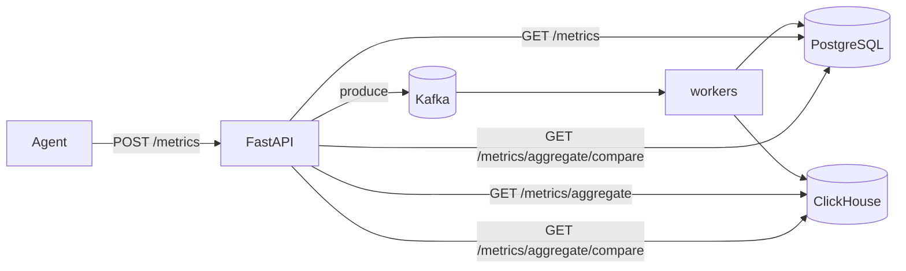

# Phase 3 Architecture — ClickHouse

Phase 3 adds a columnar time-series store for analytical queries, while keeping the Phase 2 Kafka ingest path.

```
Phase 2:  Agent → API → Kafka → worker → PostgreSQL
Day 1:    + ClickHouse up (schema + health)
Day 2:    worker dual-writes → PostgreSQL + ClickHouse
Day 3:    GET /metrics/aggregate reads from ClickHouse
Day 4:    Compare PostgreSQL vs ClickHouse at scale   ← YOU ARE HERE
Day 5:    Docs + graduation
```

---

## Current architecture (Day 4)



| Layer | Technology | Day 4 status |
|-------|------------|--------------|
| Ingest | Kafka → dual-write | Unchanged |
| Raw reads | PostgreSQL | `GET /metrics` |
| Analytics | ClickHouse | `GET /metrics/aggregate` |
| Learning tool | Both | `GET /metrics/aggregate/compare` |

---

## Day 4 lesson — measure, don't guess

At small row counts both stores feel fast — and ClickHouse HTTP overhead can even lose a micro-benchmark. Day 4 makes the difference visible at larger N:

1. **Seed** identical rows into PG + CH (`tests/load/seed_aggregate_compare.py`)
2. **Compare** the same aggregate filter/interval on both stores
3. **Read** `speedup_median` ≈ `postgres_ms / clickhouse_ms` (values > 1 mean CH was faster)

| Signal | Meaning |
|--------|---------|
| `postgres.ms_median` | Row-store aggregate cost |
| `clickhouse.ms_median` | Columnar aggregate cost |
| `speedup_median` | How many times faster CH median was |
| `sample_totals_match` | False → often CH duplicates from at-least-once dual-write |

Production traffic still uses ClickHouse only for `/metrics/aggregate`. Compare is a lab endpoint.

---

## How to run the experiment

```bash
# 1. Infra + API
docker compose up -d
uvicorn backend.main:app --reload --port 8001

# 2. Seed ~50k identical rows into both stores (skip Kafka)
python tests/load/seed_aggregate_compare.py --rows 200000

# 3. Compare (warm up once, then trust median of runs=5)
curl "http://127.0.0.1:8001/metrics/aggregate/compare?machine_id=compare-bench&metric_name=cpu_usage&start_time=2026-06-01T00:00:00Z&end_time=2026-07-01T00:00:00Z&interval=5m&runs=5"
```

Optional: `--rows 200000` for a clearer gap. Add `&include_buckets=true` to inspect series.

---

## Read-path split (Day 3, still production)

| Endpoint | Store |
|----------|-------|
| `GET /metrics` | PostgreSQL |
| `GET /metrics/aggregate` | ClickHouse |
| `GET /metrics/aggregate/compare` | Both (timed) |

---

## Dual-write commit order (Day 2)

```
1. INSERT PostgreSQL  (ON CONFLICT DO NOTHING)
2. INSERT ClickHouse  (append)
3. Kafka offset commit
```

---

## Schema (`insightnode.metrics`)

Source: [`sql/clickhouse/schema.sql`](../sql/clickhouse/schema.sql)

| Choice | Value |
|--------|-------|
| Engine | `MergeTree` |
| `PARTITION BY` | `toYYYYMM(timestamp)` |
| `ORDER BY` | `(machine_id, metric_name, timestamp)` |

---

## What Day 4 deliberately does not include

- Formal graduation checklist → **Day 5**
- `ReplacingMergeTree` / CH-side dedup
- Removing PostgreSQL
