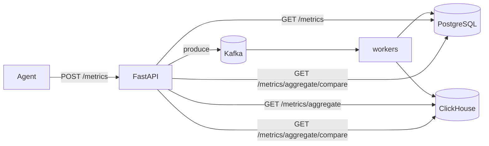

# Phase 3 Architecture — ClickHouse

Phase 3 adds a columnar time-series store for analytical queries, while keeping the Phase 2 Kafka ingest path.

```
Phase 2:  Agent → API → Kafka → worker → PostgreSQL
Day 1:    + ClickHouse up (schema + health)
Day 2:    worker dual-writes → PostgreSQL + ClickHouse
Day 3:    GET /metrics/aggregate reads from ClickHouse
Day 4:    Compare PostgreSQL vs ClickHouse at scale
Day 5:    Docs + graduation                          ← COMPLETE
```

---

## Final architecture (Phase 3 complete)



| Layer | Technology | Role |
|-------|------------|------|
| Ingest | Kafka → dual-write | Durable bus; ACK after both stores |
| Row store | PostgreSQL | Idempotent writes + raw `GET /metrics` |
| Columnar store | ClickHouse | Analytics + `GET /metrics/aggregate` |
| Lab tool | Both | `GET /metrics/aggregate/compare` |

Graduation checklist: [`phase-3-graduation.md`](phase-3-graduation.md)

---

## Day-by-day recap

| Day | Deliverable |
|-----|-------------|
| 1 | Docker ClickHouse, MergeTree schema, client ping, `clickhouse_ok` |
| 2 | Worker dual-write PG → CH → Kafka commit |
| 3 | Route `/metrics/aggregate` to ClickHouse |
| 4 | Compare endpoint + seed script |
| 5 | Architecture + graduation docs |

---

## Dual-write commit order

```
1. INSERT PostgreSQL  (ON CONFLICT DO NOTHING)
2. INSERT ClickHouse  (append)
3. Kafka offset commit
```

| Failure | What happens |
|---------|----------------|
| PG fails | Offset not committed → Kafka redelivers |
| PG ok, CH fails | Offset not committed → redeliver; PG dedupes; CH retries |
| Both ok, offset commit fails | Redeliver → PG dedupes; **CH may duplicate** |

---

## Read-path split

| Endpoint | Store |
|----------|-------|
| `GET /metrics` | PostgreSQL |
| `GET /metrics/aggregate` | ClickHouse |
| `GET /metrics/aggregate/compare` | Both (timed; learning only) |

---

## Schema (`insightnode.metrics`)

Source: [`sql/clickhouse/schema.sql`](../sql/clickhouse/schema.sql)

| Choice | Value | Why |
|--------|-------|-----|
| Engine | `MergeTree` | Append-oriented columnar default |
| `PARTITION BY` | `toYYYYMM(timestamp)` | Cheap pruning / future retention |
| `ORDER BY` | `(machine_id, metric_name, timestamp)` | Matches aggregate filters |
| Idempotency | None in CH | PG unique index remains source of truth |

---

## Compare experiment (Day 4)

```bash
docker compose up -d
uvicorn backend.main:app --reload --port 8001

python tests/load/seed_aggregate_compare.py --rows 200000

curl "http://127.0.0.1:8001/metrics/aggregate/compare?machine_id=compare-bench&metric_name=cpu_usage&start_time=2026-06-01T00:00:00Z&end_time=2026-08-01T00:00:00Z&interval=5m&runs=5"
```

At small N, ClickHouse HTTP overhead can lose a micro-benchmark. At larger N, columnar scans usually win on long-range aggregates. `speedup_median` = `postgres_ms / clickhouse_ms` (>1 ⇒ CH faster).

---

## What Phase 3 deliberately does not include

- `ReplacingMergeTree` / CH-side dedup
- Removing PostgreSQL for metrics
- Materialized rollup tables
- Centralized logs → **Phase 4 (OpenSearch)**
- Traces → **Phase 5**

---

## Env defaults

| Variable | Default |
|----------|---------|
| `CLICKHOUSE_HOST` | `localhost` |
| `CLICKHOUSE_PORT` | `8123` |
| `CLICKHOUSE_USER` | `insightnode` |
| `CLICKHOUSE_PASSWORD` | `insightnode` |
| `CLICKHOUSE_DATABASE` | `insightnode` |
