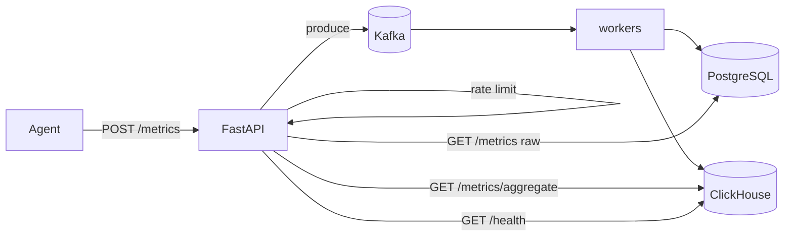

# Phase 3 Architecture — ClickHouse

Phase 3 adds a columnar time-series store for analytical queries, while keeping the Phase 2 Kafka ingest path.

```
Phase 2:  Agent → API → Kafka → worker → PostgreSQL
Day 1:    + ClickHouse up (schema + health)
Day 2:    worker dual-writes → PostgreSQL + ClickHouse
Day 3:    GET /metrics/aggregate reads from ClickHouse   ← YOU ARE HERE
Day 4:    Compare PostgreSQL vs ClickHouse at scale
Day 5:    Docs + graduation
```

---

## Current architecture (Day 3)



| Layer | Technology | Day 3 status |
|-------|------------|--------------|
| Ingest bus | Kafka (Redpanda) | Unchanged from Phase 2 |
| Row store | PostgreSQL | Idempotent writes + raw `GET /metrics` |
| Columnar store | ClickHouse | Dual-written; serves aggregates |
| Aggregate API | ClickHouse `toStartOfInterval` | Replaced PostgreSQL `date_bin` |

---

## Read-path split (the Day 3 lesson)

| Endpoint | Store | Why |
|----------|-------|-----|
| `GET /metrics` | PostgreSQL | Point lookups / debugging; row store is fine |
| `GET /metrics/aggregate` | ClickHouse | Dashboard buckets scan mostly the `value` column |

Same response JSON as Phase 1/2 — only the engine behind `/metrics/aggregate` changed.

ClickHouse bucketing uses `toStartOfInterval(timestamp, INTERVAL …)` instead of PostgreSQL `date_bin`.

---

## Dual-write commit order (Day 2, still in force)

```
1. INSERT PostgreSQL  (ON CONFLICT DO NOTHING)
2. INSERT ClickHouse  (append)
3. Kafka offset commit
```

| Failure | What happens |
|---------|----------------|
| PG fails | Offset not committed → Kafka redelivers |
| PG ok, CH fails | Offset not committed → redeliver; PG dedupes; CH retries |
| Both ok, offset commit fails | Redeliver → PG dedupes; **CH may duplicate** (accepted for now) |

---

## Schema (`insightnode.metrics`)

Source: [`sql/clickhouse/schema.sql`](../sql/clickhouse/schema.sql)

| Choice | Value | Why |
|--------|-------|-----|
| Engine | `MergeTree` | Append-oriented columnar default |
| `PARTITION BY` | `toYYYYMM(timestamp)` | Cheap time-range pruning / retention later |
| `ORDER BY` | `(machine_id, metric_name, timestamp)` | Matches aggregate filter pattern |
| Idempotency | None in CH yet | PG unique index remains source of truth |

---

## Local ops

```bash
docker compose up -d
uvicorn backend.main:app --reload --port 8001
python -m backend.worker

curl http://127.0.0.1:8001/health
# expect kafka_ok + clickhouse_ok true

# Aggregate now hits ClickHouse (after dual-write has data):
curl "http://127.0.0.1:8001/metrics/aggregate?machine_id=HOST&metric_name=cpu_usage&start_time=2026-07-22T00:00:00Z&end_time=2026-07-24T00:00:00Z&interval=5m"
```

Env overrides (optional):

| Variable | Default |
|----------|---------|
| `CLICKHOUSE_HOST` | `localhost` |
| `CLICKHOUSE_PORT` | `8123` |
| `CLICKHOUSE_USER` | `insightnode` |
| `CLICKHOUSE_PASSWORD` | `insightnode` |
| `CLICKHOUSE_DATABASE` | `insightnode` |

---

## What Day 3 deliberately does not include

- Side-by-side PG vs CH timing → **Day 4**
- `ReplacingMergeTree` / CH-side dedup → later if needed
- Removing PostgreSQL → not this phase
