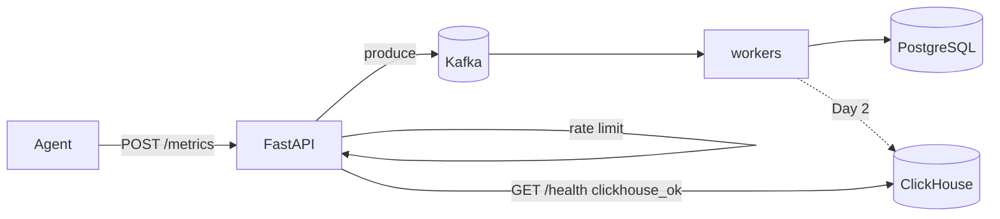

# Phase 3 Architecture — ClickHouse

Phase 3 adds a columnar time-series store for analytical queries, while keeping the Phase 2 Kafka ingest path.

```
Phase 2:  Agent → API → Kafka → worker → PostgreSQL
Day 1:    + ClickHouse up (schema + health)           ← YOU ARE HERE
Day 2:    worker dual-writes → PostgreSQL + ClickHouse
Day 3:    GET /metrics/aggregate reads from ClickHouse
Day 4:    Compare PostgreSQL vs ClickHouse at scale
Day 5:    Docs + graduation
```

---

## Current architecture (Day 1)



| Layer | Technology | Day 1 status |
|-------|------------|--------------|
| Ingest bus | Kafka (Redpanda) | Unchanged from Phase 2 |
| Row store | PostgreSQL | Still the only write target |
| Columnar store | ClickHouse | Running; empty until Day 2 |
| Aggregate API | PostgreSQL `GROUP BY` | Still PG until Day 3 |

---

## Why ClickHouse (the lesson)

| Concern | PostgreSQL (row) | ClickHouse (columnar) |
|---------|------------------|------------------------|
| Write pattern | Good OLTP / mixed | Append-heavy metrics |
| `AVG/MIN/MAX` over millions of rows | Scans whole rows | Reads mostly the `value` column |
| Time-range drops | `DELETE` is expensive | Drop partitions by month |
| Dedup | Unique index on `event_id` | No unique constraint on Day 1 — PG still owns idempotency |

Day 1 deliberately does **not** dual-write yet. First prove the store is up and the schema matches how you query.

---

## Schema (`insightnode.metrics`)

Source: [`sql/clickhouse/schema.sql`](../sql/clickhouse/schema.sql)

| Choice | Value | Why |
|--------|-------|-----|
| Engine | `MergeTree` | Append-oriented columnar default |
| `PARTITION BY` | `toYYYYMM(timestamp)` | Cheap time-range pruning / retention later |
| `ORDER BY` | `(machine_id, metric_name, timestamp)` | Matches aggregate filter pattern |
| Idempotency | None in CH yet | PG unique index remains source of truth for Day 2 |

---

## Local ops

```bash
# Start Redpanda + ClickHouse
docker compose up -d

# HTTP ping
curl http://localhost:8123/ping

# After API start — schema ensured in lifespan
curl http://127.0.0.1:8001/health
# expect clickhouse_ok: true
```

Env overrides (optional):

| Variable | Default |
|----------|---------|
| `CLICKHOUSE_HOST` | `localhost` |
| `CLICKHOUSE_PORT` | `8123` |
| `CLICKHOUSE_USER` | `insightnode` |
| `CLICKHOUSE_PASSWORD` | `insightnode` |
| `CLICKHOUSE_DATABASE` | `insightnode` |

---

## What Day 1 deliberately does not include

- Worker inserts into ClickHouse → **Day 2**
- Routing `/metrics/aggregate` to ClickHouse → **Day 3**
- `ReplacingMergeTree` / CH-side dedup → later if needed
- Removing PostgreSQL → not this phase (dual-write keeps the comparison)
