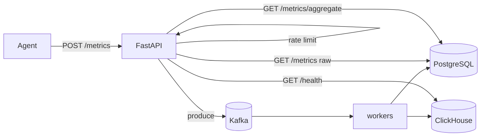

# Phase 3 Architecture — ClickHouse

Phase 3 adds a columnar time-series store for analytical queries, while keeping the Phase 2 Kafka ingest path.

```
Phase 2:  Agent → API → Kafka → worker → PostgreSQL
Day 1:    + ClickHouse up (schema + health)
Day 2:    worker dual-writes → PostgreSQL + ClickHouse   ← YOU ARE HERE
Day 3:    GET /metrics/aggregate reads from ClickHouse
Day 4:    Compare PostgreSQL vs ClickHouse at scale
Day 5:    Docs + graduation
```

---

## Current architecture (Day 2)



| Layer | Technology | Day 2 status |
|-------|------------|--------------|
| Ingest bus | Kafka (Redpanda) | Unchanged from Phase 2 |
| Row store | PostgreSQL | Idempotent writes (`event_id`) |
| Columnar store | ClickHouse | Dual-written from the same worker batch |
| Aggregate API | PostgreSQL `GROUP BY` | Still PG until Day 3 |

---

## Dual-write commit order

```
1. INSERT PostgreSQL  (ON CONFLICT DO NOTHING)
2. INSERT ClickHouse  (append)
3. Kafka offset commit
```

| Failure | What happens |
|---------|----------------|
| PG fails | Offset not committed → Kafka redelivers |
| PG ok, CH fails | Offset not committed → redeliver; PG dedupes; CH retries |
| Both ok, offset commit fails | Redeliver → PG dedupes; **CH may duplicate** (accepted Day 2) |

PostgreSQL remains the deduped source of truth. ClickHouse may see rare duplicates under at-least-once delivery until `ReplacingMergeTree` / stronger dedup later.

---

## Why ClickHouse (the lesson)

| Concern | PostgreSQL (row) | ClickHouse (columnar) |
|---------|------------------|------------------------|
| Write pattern | Good OLTP / mixed | Append-heavy metrics |
| `AVG/MIN/MAX` over millions of rows | Scans whole rows | Reads mostly the `value` column |
| Time-range drops | `DELETE` is expensive | Drop partitions by month |
| Dedup | Unique index on `event_id` | No unique constraint yet |

---

## Schema (`insightnode.metrics`)

Source: [`sql/clickhouse/schema.sql`](../sql/clickhouse/schema.sql)

| Choice | Value | Why |
|--------|-------|-----|
| Engine | `MergeTree` | Append-oriented columnar default |
| `PARTITION BY` | `toYYYYMM(timestamp)` | Cheap time-range pruning / retention later |
| `ORDER BY` | `(machine_id, metric_name, timestamp)` | Matches aggregate filter pattern |
| Idempotency | None in CH yet | PG unique index remains source of truth |

---

## Local ops

```bash
docker compose up -d
uvicorn backend.main:app --reload --port 8001
python -m backend.worker

# Health
curl http://127.0.0.1:8001/health
# expect kafka_ok + clickhouse_ok true

# After the agent runs, count CH rows:
docker exec -it insightnode-clickhouse clickhouse-client \
  --user insightnode --password insightnode \
  -q "SELECT count() FROM insightnode.metrics"
```

Env overrides (optional):

| Variable | Default |
|----------|---------|
| `CLICKHOUSE_HOST` | `localhost` |
| `CLICKHOUSE_PORT` | `8123` |
| `CLICKHOUSE_USER` | `insightnode` |
| `CLICKHOUSE_PASSWORD` | `insightnode` |
| `CLICKHOUSE_DATABASE` | `insightnode` |

---

## What Day 2 deliberately does not include

- Routing `/metrics/aggregate` to ClickHouse → **Day 3**
- `ReplacingMergeTree` / CH-side dedup → later if needed
- Removing PostgreSQL → not this phase (dual-write keeps the comparison)
