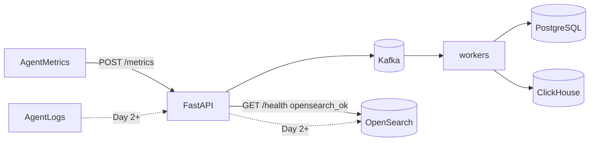

# Phase 4 Architecture — OpenSearch (logs)

Phase 4 adds centralized **log search**. Metrics stay on the Phase 2–3 path (Kafka → PostgreSQL + ClickHouse). Logs are a different signal: high-cardinality text you need to **find**, not chart.

```
Phase 3:  metrics → Kafka → PG + ClickHouse; aggregate on CH
Day 1:    + OpenSearch up (index + health)              ← YOU ARE HERE
Day 2:    POST /logs ingest (+ optional Kafka log topic)
Day 3:    GET /logs/search full-text + filters
Day 4:    Agent / API structured log shipping
Day 5:    Docs + graduation
```

---

## Current architecture (Day 1)



| Signal | Store | Why |
|--------|-------|-----|
| Metrics (gauges) | PG + ClickHouse | Numbers / aggregates |
| Logs (text events) | OpenSearch | Full-text search + filters |

Day 1 deliberately does **not** ingest logs yet. First prove the cluster and index exist.

---

## Index: `insightnode-logs`

Source: [`opensearch/logs_index.json`](../opensearch/logs_index.json)

| Field | Type | Why |
|-------|------|-----|
| `timestamp` | `date` | Time-range filters |
| `machine_id` | `keyword` | Exact host filter |
| `service` | `keyword` | Exact service filter (`agent`, `api`, `worker`) |
| `level` | `keyword` | `info` / `warn` / `error` |
| `message` | `text` | Full-text search |
| `event_id` | `keyword` | Correlation / idempotency later |
| `attrs` | `object` | Extra structured fields |

Local cluster: single-node, **security plugin disabled** (learning only — never expose to the internet).

---

## Local ops

```bash
docker compose up -d
# OpenSearch HTTP on localhost:9200

curl http://localhost:9200
# expect cluster name insightnode

# After API start — index ensured in lifespan
curl http://127.0.0.1:8001/health
# expect opensearch_ok: true
```

Env overrides (optional):

| Variable | Default |
|----------|---------|
| `OPENSEARCH_HOST` | `localhost` |
| `OPENSEARCH_PORT` | `9200` |
| `OPENSEARCH_LOGS_INDEX` | `insightnode-logs` |

---

## What Day 1 deliberately does not include

- `POST /logs` / indexing documents → **Day 2**
- `GET /logs/search` → **Day 3**
- Agent log shipping → **Day 4**
- OpenSearch Dashboards UI → optional later
- Production TLS / security plugin → out of scope for local learning
