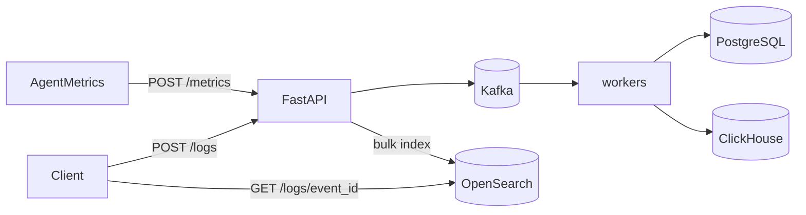

# Phase 4 Architecture — OpenSearch (logs)

Phase 4 adds centralized **log search**. Metrics stay on the Phase 2–3 path (Kafka → PostgreSQL + ClickHouse). Logs are a different signal: high-cardinality text you need to **find**, not chart.

```
Phase 3:  metrics → Kafka → PG + ClickHouse; aggregate on CH
Day 1:    + OpenSearch up (index + health)
Day 2:    POST /logs → OpenSearch                    ← YOU ARE HERE
Day 3:    GET /logs/search full-text + filters
Day 4:    Agent / API structured log shipping
Day 5:    Docs + graduation
```

---

## Current architecture (Day 2)



| Signal | Path | Why |
|--------|------|-----|
| Metrics | Kafka → PG + CH | Numbers / aggregates / durable bus |
| Logs | `POST /logs` → OpenSearch | Text events; Day 2 learns the document model first |

Day 2 indexes **directly** (no Kafka log topic yet). That keeps the lesson on OpenSearch documents / `_id` / bulk index. A durable log bus can mirror metrics later if you want.

---

## Day 2 lesson — documents, not rows

| Concept | InsightNode usage |
|---------|-------------------|
| Index | `insightnode-logs` (like a table) |
| Document | One structured log event |
| `_id` | = `event_id` → re-POST overwrites (idempotent-ish) |
| `keyword` fields | Exact filters (`level`, `machine_id`, `service`) |
| `text` field | `message` — analyzed for Day 3 full-text search |
| Bulk index | Many logs in one HTTP round-trip |

---

## Index: `insightnode-logs`

Source: [`opensearch/logs_index.json`](../opensearch/logs_index.json)

| Field | Type | Why |
|-------|------|-----|
| `timestamp` | `date` | Time-range filters |
| `machine_id` | `keyword` | Exact host filter |
| `service` | `keyword` | Exact service filter (`agent`, `api`, `worker`) |
| `level` | `keyword` | `debug` / `info` / `warn` / `error` |
| `message` | `text` | Full-text search (Day 3) |
| `event_id` | `keyword` | Correlation + document `_id` |
| `attrs` | `object` | Extra structured fields |

---

## APIs (Day 2)

### `POST /logs`

```bash
curl -s -X POST http://127.0.0.1:8001/logs \
  -H 'Content-Type: application/json' \
  -d '{
    "logs": [{
      "event_id": "550e8400-e29b-41d4-a716-446655440000",
      "machine_id": "my-machine",
      "service": "agent",
      "level": "warn",
      "message": "disk usage high on /",
      "timestamp": "2026-07-23T08:00:00+00:00",
      "attrs": {"path": "/", "percent": 92}
    }]
  }'
```

Returns `202` with `{ status, indexed, ids }`.

### `GET /logs/{event_id}`

Fetch one document by id (lab verification). Full search is Day 3.

---

## Local ops

```bash
docker compose up -d
uvicorn backend.main:app --reload --port 8001

curl http://127.0.0.1:8001/health
# expect opensearch_ok: true
```

Env overrides (optional):

| Variable | Default |
|----------|---------|
| `OPENSEARCH_HOST` | `localhost` |
| `OPENSEARCH_PORT` | `9200` |
| `OPENSEARCH_LOGS_INDEX` | `insightnode-logs` |

---

## What Day 2 deliberately does not include

- Full-text `GET /logs/search` → **Day 3**
- Agent auto log shipping → **Day 4**
- Kafka topic for logs → later / optional
- OpenSearch Dashboards UI → optional later
