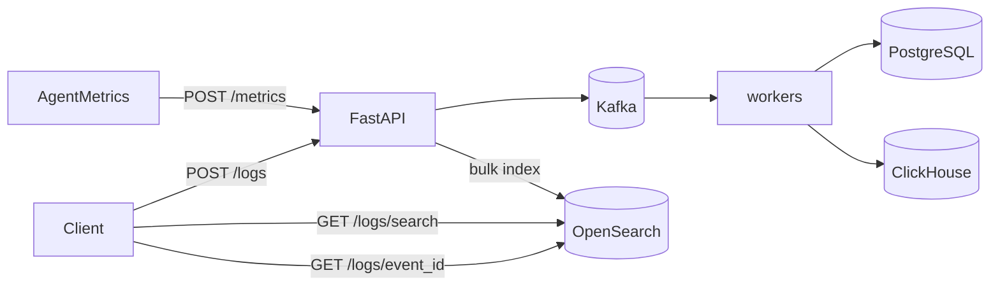

# Phase 4 Architecture — OpenSearch (logs)

Phase 4 adds centralized **log search**. Metrics stay on the Phase 2–3 path (Kafka → PostgreSQL + ClickHouse). Logs are a different signal: high-cardinality text you need to **find**, not chart.

```
Phase 3:  metrics → Kafka → PG + ClickHouse; aggregate on CH
Day 1:    + OpenSearch up (index + health)
Day 2:    POST /logs → OpenSearch
Day 3:    GET /logs/search full-text + filters         ← YOU ARE HERE
Day 4:    Agent / API structured log shipping
Day 5:    Docs + graduation
```

---

## Current architecture (Day 3)



| Signal | Path | Why |
|--------|------|-----|
| Metrics | Kafka → PG + CH | Numbers / aggregates |
| Logs | OpenSearch | Full-text + keyword filters |

---

## Day 3 lesson — search vs get-by-id

| API | What it does |
|-----|----------------|
| `GET /logs/{event_id}` | Direct document lookup by `_id` (Day 2) |
| `GET /logs/search` | Query DSL: text match + filters + time range |

OpenSearch `bool` query shape we use:

```
must:   match message   ← scored full-text (optional)
filter: term / range    ← exact level, host, service, time (not scored)
```

| Concept | Why it matters |
|---------|----------------|
| `text` (`message`) | Analyzed tokens — "disk usage" finds that phrase |
| `keyword` (`level`, …) | Exact equality — `level=error` |
| `filter` context | Faster, cacheable; does not affect `_score` |
| `must` / `match` | Relevance ranking when you pass `q` |

Route order matters: `/logs/search` is registered **before** `/logs/{event_id}` so FastAPI does not treat `"search"` as an event id.

---

## APIs

### `POST /logs` (Day 2)

Bulk index; `event_id` = document `_id`.

### `GET /logs/search` (Day 3)

| Param | Type | Description |
|-------|------|-------------|
| `q` | string | Full-text on `message` (AND) |
| `machine_id` | string | Exact host |
| `service` | string | Exact service |
| `level` | string | `debug` / `info` / `warn` / `error` |
| `start_time` / `end_time` | ISO 8601 | Time range (`end` exclusive) |
| `limit` / `offset` | int | Pagination (newest first) |

```bash
curl "http://127.0.0.1:8001/logs/search?q=disk&level=warn&limit=10"
```

### `GET /logs/{event_id}` (Day 2)

Fetch one document by id.

---

## Index: `insightnode-logs`

Source: [`opensearch/logs_index.json`](../opensearch/logs_index.json)

| Field | Type | Role in Day 3 |
|-------|------|----------------|
| `message` | `text` | `q` full-text |
| `machine_id` / `service` / `level` | `keyword` | Exact filters |
| `timestamp` | `date` | Range filter + sort |

---

## Local ops

```bash
docker compose up -d
uvicorn backend.main:app --reload --port 8001

# Index a sample, then search
curl -s -X POST http://127.0.0.1:8001/logs -H 'Content-Type: application/json' -d '{...}'
curl "http://127.0.0.1:8001/logs/search?q=disk&level=warn"
```

---

## What Day 3 deliberately does not include

- Agent auto log shipping → **Day 4**
- Kafka topic for logs → later / optional
- Aggregations / log patterns / alerting → later
- OpenSearch Dashboards UI → optional later
