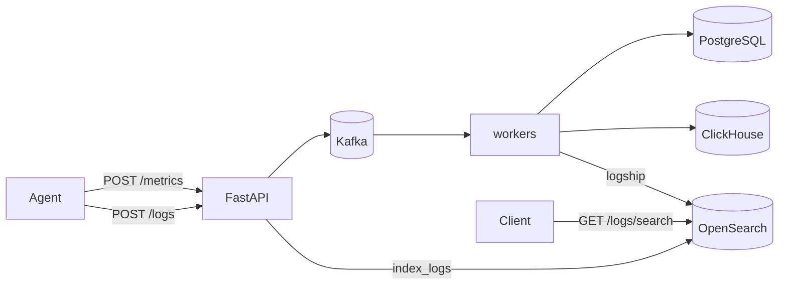

# Phase 4 Architecture — OpenSearch (logs)

Phase 4 adds centralized **log search**. Metrics stay on the Phase 2–3 path (Kafka → PostgreSQL + ClickHouse). Logs are a different signal: high-cardinality text you need to **find**, not chart.

```
Phase 3:  metrics → Kafka → PG + ClickHouse; aggregate on CH
Day 1:    + OpenSearch up (index + health)
Day 2:    POST /logs → OpenSearch
Day 3:    GET /logs/search full-text + filters
Day 4:    Agent / API structured log shipping
Day 5:    Docs + graduation                          ← COMPLETE
```

---

## Final architecture (Phase 4 complete)



| Signal | Store | Role |
|--------|-------|------|
| Metrics | Kafka → PG + ClickHouse | Gauges, aggregates |
| Logs | OpenSearch | Full-text + filters |

Graduation checklist: [`phase-4-graduation.md`](phase-4-graduation.md)

---

## Day-by-day recap

| Day | Deliverable |
|-----|-------------|
| 1 | Docker OpenSearch, `insightnode-logs` mapping, client ping, `opensearch_ok` |
| 2 | `POST /logs` + `GET /logs/{event_id}` |
| 3 | `GET /logs/search` (`must` + `filter` bool query) |
| 4 | Agent / API / worker structured log shipping |
| 5 | Architecture + graduation docs |

---

## Index: `insightnode-logs`

Source: [`opensearch/logs_index.json`](../opensearch/logs_index.json)

| Field | Type | Role |
|-------|------|------|
| `timestamp` | `date` | Range + sort |
| `machine_id` / `service` / `level` | `keyword` | Exact filters |
| `message` | `text` | Full-text `q` |
| `event_id` | `keyword` | Document `_id` + correlation |
| `attrs` | `object` | Extra structured fields |

---

## Log producers

| Producer | Path | `service` |
|----------|------|-----------|
| Agent | HTTP `POST /logs` (`agent/logship.py`) | `agent` |
| API | In-process (`backend/logship.py`) | `api` |
| Worker | In-process (`backend/logship.py`) | `worker` |

Shipping is **best-effort** — never blocks metric ingest or spool.

---

## APIs

| Endpoint | Role |
|----------|------|
| `POST /logs` | Bulk index |
| `GET /logs/search` | Full-text + filters |
| `GET /logs/{event_id}` | Direct get by id |

```bash
curl "http://127.0.0.1:8001/logs/search?service=agent&level=warn&q=Disk"
curl "http://127.0.0.1:8001/logs/search?service=api&q=rate"
curl "http://127.0.0.1:8001/logs/search?service=worker&level=error"
```

---

## What Phase 4 deliberately does not include

- Shipping every Python log line (noise)
- Kafka topic dedicated to logs
- OpenSearch Dashboards UI
- Production TLS / security plugin
- Distributed traces → **Phase 5 (OpenTelemetry)**
