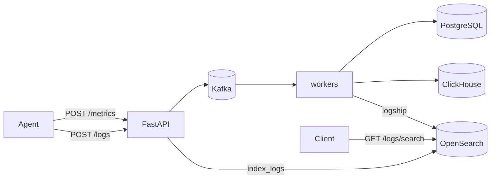

# Phase 4 Architecture — OpenSearch (logs)

Phase 4 adds centralized **log search**. Metrics stay on the Phase 2–3 path (Kafka → PostgreSQL + ClickHouse). Logs are a different signal: high-cardinality text you need to **find**, not chart.

```
Phase 3:  metrics → Kafka → PG + ClickHouse; aggregate on CH
Day 1:    + OpenSearch up (index + health)
Day 2:    POST /logs → OpenSearch
Day 3:    GET /logs/search full-text + filters
Day 4:    Agent / API structured log shipping          ← YOU ARE HERE
Day 5:    Docs + graduation
```

---

## Current architecture (Day 4)



| Producer | How logs are shipped | `service` field |
|----------|----------------------|-----------------|
| Agent | HTTP `POST /logs` via `agent/logship.py` | `agent` |
| API | In-process `backend/logship.py` → OpenSearch | `api` |
| Worker | In-process `backend/logship.py` → OpenSearch | `worker` |

Log shipping is **best-effort**: failures never break metric ingest or spooling.

---

## Day 4 lesson — ship events, not stdout

| Before | After |
|--------|-------|
| `print("[RETRY] …")` only on console | Also a structured OpenSearch document |
| Guess which host failed | Filter `service=agent` + `machine_id=…` |
| Metrics show high disk | Logs explain "Disk usage high: 92%" with attrs |

What the agent ships:

- Startup `info`
- Retry / send failure `warn` / `error`
- Spool replay / pending `info` / `warn`
- Threshold crossings (`cpu` / `memory` / `disk`) as `warn`

What API / worker ship:

- Rate limit exceeded (`api` / `warn`)
- Kafka lag backpressure (`api` / `warn`)
- Uncommitted retry / DLQ poison (`worker` / `warn` / `error`)

---

## Search examples

```bash
# Agent threshold warnings
curl "http://127.0.0.1:8001/logs/search?service=agent&level=warn&q=Disk"

# API rate limits
curl "http://127.0.0.1:8001/logs/search?service=api&q=rate"

# Worker DLQ events
curl "http://127.0.0.1:8001/logs/search?service=worker&level=error"
```

Lower agent thresholds for a demo:

```bash
DISK_WARN_PERCENT=1 CPU_WARN_PERCENT=1 MEMORY_WARN_PERCENT=1 python main.py
```

---

## APIs (Days 2–3, still in force)

| Endpoint | Role |
|----------|------|
| `POST /logs` | Bulk index (agent uses this) |
| `GET /logs/search` | Full-text + filters |
| `GET /logs/{event_id}` | Direct get by id |

---

## What Day 4 deliberately does not include

- Shipping every Python `logger.info` line (too noisy)
- Kafka topic for logs (direct / in-process is enough for learning)
- Formal graduation → **Day 5**
