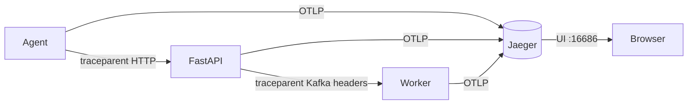

# Phase 5 Architecture — OpenTelemetry + Jaeger (traces)

Phase 5 adds **distributed tracing**: follow one request/work unit across API → Kafka → worker (and the agent). Metrics answer “how much?”, logs answer “what happened?”, traces answer “where did time go across services?”

```
Phase 4:  logs → OpenSearch
Day 1:    + Jaeger up (OTLP + UI) + TracerProvider bootstrap
Day 2:    Instrument FastAPI HTTP requests (auto spans)
Day 3:    Propagate context across Kafka (agent → API → worker)  ← YOU ARE HERE
Day 4:    Manual spans for dual-write / logship + event_id attrs
Day 5:    Docs + graduation
```

---

## Current architecture (Day 3)



| Hop | Mechanism | Span |
|-----|-----------|------|
| Agent → API | W3C `traceparent` HTTP header | `agent.push_metrics` (CLIENT) → `POST /metrics` (SERVER) |
| API → Worker | Same headers on Kafka record | `kafka.produce` (PRODUCER) → `kafka.consume` (CONSUMER) |

Same `trace_id` across all three services. Jaeger UI → any service → Find Traces shows the full chain.

---

## Day 3 lesson — context propagation

```
inject(carrier)   # write traceparent from current span
extract(carrier)  # rebuild parent context in another process
```

| Carrier | Where |
|---------|--------|
| HTTP headers | Agent `httpx.post(..., headers=inject())` |
| Kafka headers | `producer.send(..., headers=[(k, bytes)])` |

Without inject/extract, each process starts a **new** root span — you cannot stitch agent → API → worker into one waterfall.

---

## Services in Jaeger

| `service.name` | Process |
|----------------|---------|
| `insightnode-agent` | `python agent/main.py` |
| `insightnode-api` | `uvicorn backend.main:app` |
| `insightnode-worker` | `python -m backend.worker` |

Embedded worker (`EMBEDDED_WORKER=1`) shares the API process → spans appear under `insightnode-api`.

---

## Local ops

```bash
docker compose up -d
uvicorn backend.main:app --reload --port 8001
python -m backend.worker
# optional: python agent/main.py

# Or curl with a synthetic parent (still exercises API → Kafka → worker):
curl -X POST "http://127.0.0.1:8001/metrics" \
  -H "Content-Type: application/json" \
  -d '{"machine_id":"demo","timestamp":"2026-07-22T12:00:00Z","metrics":[{"name":"cpu_usage","value":1,"unit":"%"}],"event_id":"day3-demo"}'

open http://localhost:16686
# Service: insightnode-api or insightnode-worker → Find Traces
# Expect: POST /metrics → kafka.produce → kafka.consume (same trace)
```

---

## Three pillars

| Pillar | Store | Question |
|--------|-------|----------|
| Metrics | PG + ClickHouse | How much? |
| Logs | OpenSearch | What message? |
| Traces | Jaeger | Where did time go? |

---

## What Day 3 deliberately does not include

- Manual spans around dual-write / logship internals → **Day 4**
- Sampling strategies / tail-based sampling → later
- Trace↔log correlation fields in OpenSearch → Day 4/5
