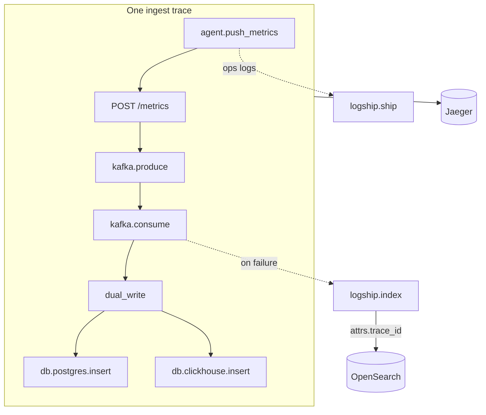

# Phase 5 Architecture — OpenTelemetry + Jaeger (traces)

Phase 5 adds **distributed tracing**: follow one request/work unit across API → Kafka → worker (and the agent). Metrics answer “how much?”, logs answer “what happened?”, traces answer “where did time go across services?”

```
Phase 4:  logs → OpenSearch
Day 1:    + Jaeger up (OTLP + UI) + TracerProvider bootstrap
Day 2:    Instrument FastAPI HTTP requests (auto spans)
Day 3:    Propagate context across Kafka (agent → API → worker)
Day 4:    Manual spans for dual-write / logship + event_id attrs  ← YOU ARE HERE
Day 5:    Docs + graduation
```

---

## Current architecture (Day 4)



| Span | Kind | Where |
|------|------|--------|
| `agent.push_metrics` | CLIENT | Agent HTTP POST |
| `POST /metrics` | SERVER | FastAPI auto |
| `kafka.produce` / `kafka.consume` | PRODUCER / CONSUMER | Day 3 |
| `dual_write` | INTERNAL | Worker parent for both stores |
| `db.postgres.insert` | INTERNAL | PG dual-write step |
| `db.clickhouse.insert` | INTERNAL | CH dual-write step |
| `logship.index` / `logship.ship` | INTERNAL | Ops log shipping |

Common attributes: `insightnode.event_id`, `insightnode.row_count`, `db.system`.

---

## Day 4 lesson — manual spans + correlation

```
with manual_span("dual_write"):
    with manual_span("db.postgres.insert"): ...
    with manual_span("db.clickhouse.insert"): ...
```

| Approach | Covers |
|----------|--------|
| Auto (Day 2) | HTTP edge |
| Propagation (Day 3) | Same `trace_id` across processes |
| Manual (Day 4) | Steps *inside* a process (PG vs CH vs logship) |

**Trace ↔ log:** `logship` merges `attrs.trace_id` / `attrs.span_id` from the active span. Search OpenSearch for a Jaeger `trace_id` to find related ops messages.

```bash
# Example: after copying a trace id from Jaeger
curl -s "http://127.0.0.1:8001/logs/search?q=*&limit=5"
# Filter in UI / query attrs.trace_id when shipping fires (rate-limit, DLQ, …)
```

---

## Services in Jaeger

| `service.name` | Process |
|----------------|---------|
| `insightnode-agent` | `python agent/main.py` |
| `insightnode-api` | `uvicorn backend.main:app` |
| `insightnode-worker` | `python -m backend.worker` |

---

## Local ops

```bash
docker compose up -d
uvicorn backend.main:app --reload --port 8001
python -m backend.worker

# Trigger a full waterfall (use a real UUID for event_id):
python - <<'PY'
import uuid, httpx
eid = str(uuid.uuid4())
r = httpx.post("http://127.0.0.1:8001/metrics", json={
    "machine_id": "day4-demo",
    "timestamp": "2026-07-23T12:00:00Z",
    "event_id": eid,
    "metrics": [{"name": "cpu_usage", "value": 3.0, "unit": "%"}],
})
print(r.status_code, eid, r.json())
PY

open http://localhost:16686
# Expect under insightnode-worker:
#   kafka.consume → dual_write → db.postgres.insert + db.clickhouse.insert
```

---

## Three pillars

| Pillar | Store | Question |
|--------|-------|----------|
| Metrics | PG + ClickHouse | How much? |
| Logs | OpenSearch (`attrs.trace_id`) | What message? |
| Traces | Jaeger | Where did time go? |

---

## What Day 4 deliberately does not include

- Graduation write-up / sampling strategies → **Day 5**
- Auto-instrumentation of SQLAlchemy / ClickHouse drivers → optional later
- Changing dual-write semantics (still PG → CH → Kafka commit)
