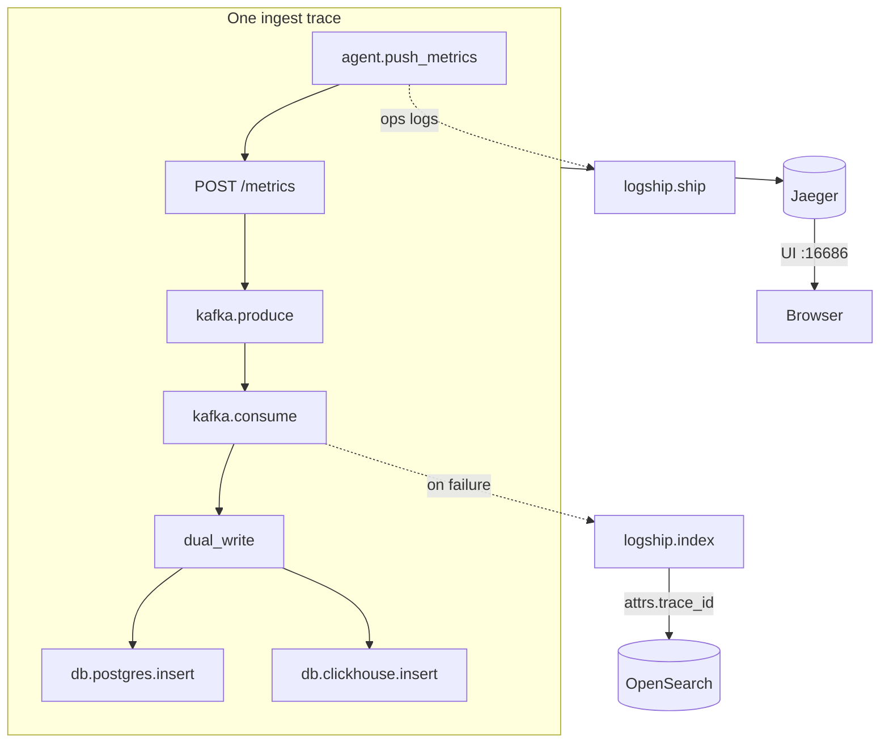

# Phase 5 Architecture — OpenTelemetry + Jaeger (traces)

Phase 5 adds **distributed tracing**: follow one request/work unit across agent → API → Kafka → worker. Metrics answer “how much?”, logs answer “what happened?”, traces answer “where did time go across services?”

**Status:** Phase 5 complete (Days 1–5). See [phase-5-graduation.md](phase-5-graduation.md).

```
Day 1:  Jaeger up (OTLP + UI) + TracerProvider bootstrap
Day 2:  Instrument FastAPI HTTP requests (auto spans)
Day 3:  Propagate context across Kafka (agent → API → worker)
Day 4:  Manual spans for dual-write / logship + event_id attrs
Day 5:  Docs + graduation
```

---

## End-state architecture



| Span | Kind | Where |
|------|------|--------|
| `agent.push_metrics` | CLIENT | Agent HTTP POST |
| `POST /metrics` | SERVER | FastAPI auto-instrumentation |
| `kafka.produce` / `kafka.consume` | PRODUCER / CONSUMER | W3C headers on Kafka records |
| `dual_write` | INTERNAL | Worker parent for both stores |
| `db.postgres.insert` | INTERNAL | PG dual-write step |
| `db.clickhouse.insert` | INTERNAL | CH dual-write step |
| `logship.index` / `logship.ship` | INTERNAL | Ops log shipping |

Common attributes: `insightnode.event_id`, `insightnode.row_count`, `db.system`.

---

## Day-by-day lessons

| Day | Lesson |
|-----|--------|
| 1 | SDK → OTLP → Jaeger pipeline before any route instrumentation |
| 2 | Auto-instrumentation for HTTP edges; instrument at import time |
| 3 | `inject` / `extract` keep one `trace_id` across processes |
| 4 | Manual spans show *inside* dual-write; logs carry `trace_id` |
| 5 | Document the three pillars and graduate |

### Propagation carriers

| Carrier | Hop |
|---------|-----|
| HTTP `traceparent` | Agent → API |
| Kafka message headers | API → Worker |

### Trace ↔ log

`logship` merges `attrs.trace_id` / `attrs.span_id` from the active span. Copy a trace id from Jaeger and search OpenSearch / `GET /logs/search` when ops events fire (rate-limit, DLQ, retries).

---

## Services in Jaeger

| `service.name` | Process |
|----------------|---------|
| `insightnode-agent` | `python agent/main.py` |
| `insightnode-api` | `uvicorn backend.main:app` |
| `insightnode-worker` | `python -m backend.worker` |

Embedded worker (`EMBEDDED_WORKER=1`) shares the API process → spans appear under `insightnode-api`.

Disable everything: `OTEL_ENABLED=0`.

---

## Local ops

```bash
docker compose up -d
uvicorn backend.main:app --reload --port 8001
python -m backend.worker
# optional: python agent/main.py

python - <<'PY'
import uuid, httpx
eid = str(uuid.uuid4())
r = httpx.post("http://127.0.0.1:8001/metrics", json={
    "machine_id": "day5-demo",
    "timestamp": "2026-07-23T12:00:00Z",
    "event_id": eid,
    "metrics": [{"name": "cpu_usage", "value": 3.0, "unit": "%"}],
})
print(r.status_code, eid, r.json())
PY

open http://localhost:16686
# Expect: POST /metrics → kafka.produce → kafka.consume
#          → dual_write → db.postgres.insert + db.clickhouse.insert
```

---

## Three pillars

| Pillar | Store | Question |
|--------|-------|----------|
| Metrics | PostgreSQL + ClickHouse | How much? |
| Logs | OpenSearch (`attrs.trace_id`) | What message? |
| Traces | Jaeger | Where did time go? |

---

## Deliberately out of scope (later)

- Tail-based / probabilistic sampling strategies
- Auto-instrumentation of SQLAlchemy / ClickHouse / kafka-python drivers
- Changing dual-write commit semantics
- Full APM product features (service maps at scale, SLOs, etc.)
