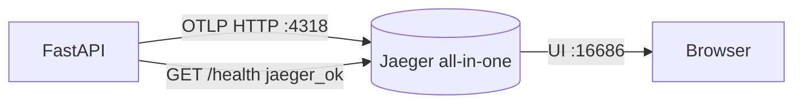

# Phase 5 Architecture — OpenTelemetry + Jaeger (traces)

Phase 5 adds **distributed tracing**: follow one request/work unit across API → Kafka → worker (and later the agent). Metrics answer “how much?”, logs answer “what happened?”, traces answer “where did time go across services?”

```
Phase 4:  logs → OpenSearch
Day 1:    + Jaeger up (OTLP + UI) + TracerProvider bootstrap   ← YOU ARE HERE
Day 2:    Instrument FastAPI HTTP requests (auto spans)
Day 3:    Propagate context across Kafka (agent → API → worker)
Day 4:    Manual spans for dual-write / logship + event_id attrs
Day 5:    Docs + graduation
```

---

## Current architecture (Day 1)



| Concept | InsightNode Day 1 |
|---------|-------------------|
| Trace | A tree of spans for one logical operation |
| Span | One timed unit of work (`startup.bootstrap` today) |
| OTLP | Wire format SDK → Jaeger collector |
| Jaeger UI | Browse traces by `service.name` |

Day 1 deliberately does **not** instrument routes yet. First prove: SDK → OTLP → Jaeger UI.

---

## Local ops

```bash
docker compose up -d
# Jaeger UI:  http://localhost:16686
# OTLP HTTP:  http://localhost:4318
# OTLP gRPC:  http://localhost:4317

pip install -r requirements.txt
uvicorn backend.main:app --reload --port 8001

curl http://127.0.0.1:8001/health
# expect jaeger_ok: true

# In Jaeger UI → Service: insightnode-api → Find Traces
# Look for span name: startup.bootstrap
```

Env overrides:

| Variable | Default |
|----------|---------|
| `OTEL_ENABLED` | `1` |
| `OTEL_SERVICE_NAME` | `insightnode-api` |
| `OTEL_EXPORTER_OTLP_ENDPOINT` | `http://localhost:4318` |
| `JAEGER_UI_URL` | `http://localhost:16686` |

Set `OTEL_ENABLED=0` to skip tracing.

---

## Three pillars (where Phase 5 fits)

| Pillar | Store in InsightNode | Question |
|--------|----------------------|----------|
| Metrics | PG + ClickHouse | How much CPU? p50 latency of aggregates? |
| Logs | OpenSearch | What error message on host X? |
| Traces | Jaeger | Which span was slow in this request path? |

---

## What Day 1 deliberately does not include

- FastAPI auto-instrumentation → **Day 2**
- Trace context over Kafka / agent → **Day 3**
- Manual dual-write spans → **Day 4**
- OpenTelemetry Collector as a separate hop → optional later
