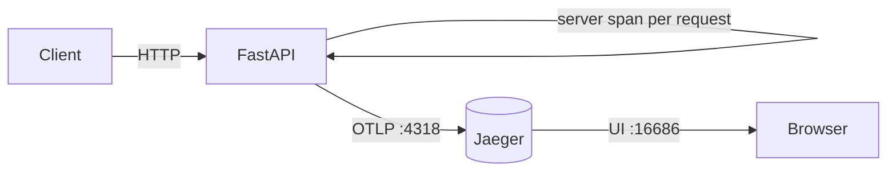

# Phase 5 Architecture — OpenTelemetry + Jaeger (traces)

Phase 5 adds **distributed tracing**: follow one request/work unit across API → Kafka → worker (and later the agent). Metrics answer “how much?”, logs answer “what happened?”, traces answer “where did time go across services?”

```
Phase 4:  logs → OpenSearch
Day 1:    + Jaeger up (OTLP + UI) + TracerProvider bootstrap
Day 2:    Instrument FastAPI HTTP requests (auto spans)   ← YOU ARE HERE
Day 3:    Propagate context across Kafka (agent → API → worker)
Day 4:    Manual spans for dual-write / logship + event_id attrs
Day 5:    Docs + graduation
```

---

## Current architecture (Day 2)



| Concept | Day 2 meaning |
|---------|----------------|
| Server span | One span wrapping an inbound HTTP request |
| Span name | e.g. `GET /logs/search`, `POST /metrics` |
| Attributes | `http.method`, `http.route`, status code, … |
| Excluded | `/health`, `/docs`, OpenAPI (less UI noise) |

Each request is still a **single-service** trace. Cross-process linking (Kafka) is Day 3.

---

## Day 2 lesson — auto-instrumentation

```
setup_tracing()           # TracerProvider + OTLP exporter
instrument_fastapi(app)   # ASGI middleware creates spans
```

| Approach | When |
|----------|------|
| Auto (Day 2) | HTTP edge — every route for free |
| Manual (Day 4) | Dual-write, logship, custom steps |
| Propagation (Day 3) | Same `trace_id` across API → worker |

Excluded URLs (env `OTEL_EXCLUDED_URLS`): `health,docs,openapi.json,redoc,favicon.ico`

---

## Local ops

```bash
docker compose up -d
uvicorn backend.main:app --reload --port 8001

# Generate spans (not /health — excluded)
curl "http://127.0.0.1:8001/pipeline"
curl "http://127.0.0.1:8001/logs/search?limit=5"

# Jaeger UI → Service insightnode-api → Find Traces
open http://localhost:16686
```

---

## Three pillars

| Pillar | Store | Question |
|--------|-------|----------|
| Metrics | PG + ClickHouse | How much? |
| Logs | OpenSearch | What message? |
| Traces | Jaeger | Where did time go? |

---

## What Day 2 deliberately does not include

- Trace context in Kafka headers / agent → **Day 3**
- Manual spans around dual-write → **Day 4**
- Client instrumentation of `httpx` in the agent → Day 3/4
