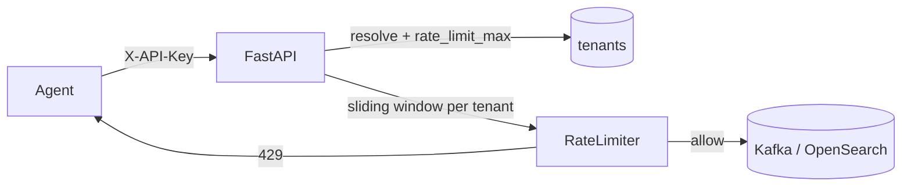

# Phase 6 Architecture — Multi-tenancy & SaaS concerns

Phase 6 turns InsightNode from a single-operator lab into a **multi-tenant** learning SaaS: identify who is calling, isolate their data, limit and meter usage, and understand sharding by tenant.

```
Phase 5:  metrics + logs + traces (three pillars)
Day 1:    Tenant registry + X-API-Key identity
Day 2:    Persist / query by tenant_id (storage isolation)
Day 3:    Per-tenant rate limits (upgrade from machine_id)  ← YOU ARE HERE
Day 4:    Usage metering + simple quotas
Day 5:    Sharding concepts + docs + graduation
```

---

## Current architecture (Day 3)



| Before (Phase 2) | After (Phase 6 Day 3) |
|------------------|------------------------|
| Key = `machine_id` | Key = `tenant:{tenant_id}` |
| One noisy host throttled | Whole customer plan ceiling |
| Fixed `RATE_LIMIT_MAX` | Optional `tenants.rate_limit_max` override |

`POST /metrics` and `POST /logs` **share** the same tenant counter — one budget for all ingest.

---

## Day 3 lesson — plan ceilings, not host ceilings

```
machine_id limit  →  stops one looping agent
tenant_id limit   →  stops one customer from starving the shared pipeline
```

SaaS products sell **tenant** quotas. Host-level limits are still useful as a secondary fairness tool; Day 3 replaces the primary key with the tenant.

| Config | Meaning |
|--------|---------|
| `RATE_LIMIT_MAX` | Global default (env) |
| `tenants.rate_limit_max` | Per-tenant override (`NULL` → use default) |
| `RATE_LIMIT_WINDOW_SECONDS` | Sliding window length |

Still **in-process** (not Redis) — multi-replica APIs would each count separately until a shared store (same idea as Phase 2 notes).

---

## Local ops

```bash
# See effective limit
curl http://127.0.0.1:8001/tenants

# Optional: tighten local tenant for a lab
# psql … -c "UPDATE tenants SET rate_limit_max = 5 WHERE tenant_id = 'local';"

# Burn the budget (should end in 429)
for i in $(seq 1 40); do
  curl -s -o /dev/null -w "%{http_code}\n" -X POST "http://127.0.0.1:8001/metrics" \
    -H "Content-Type: application/json" \
    -H "X-API-Key: dev-local-key" \
    -d "{\"machine_id\":\"rl-$i\",\"timestamp\":\"2026-07-23T12:00:00Z\",\"event_id\":\"$(uuidgen)\",\"metrics\":[{\"name\":\"cpu_usage\",\"value\":1,\"unit\":\"%\"}]}"
done
```

429 responses include `Retry-After` and `X-RateLimit-Limit`.

---

## What Day 3 deliberately does not include

- Cumulative usage metering / monthly quotas → **Day 4**
- Redis-backed distributed counters → later / production
- Physical sharding → **Day 5**
