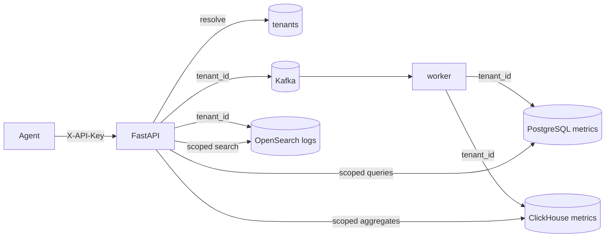

# Phase 6 Architecture — Multi-tenancy & SaaS concerns

Phase 6 turns InsightNode from a single-operator lab into a **multi-tenant** learning SaaS: identify who is calling, isolate their data, limit and meter usage, and understand sharding by tenant.

```
Phase 5:  metrics + logs + traces (three pillars)
Day 1:    Tenant registry + X-API-Key identity
Day 2:    Persist / query by tenant_id (storage isolation)  ← YOU ARE HERE
Day 3:    Per-tenant rate limits (upgrade from machine_id)
Day 4:    Usage metering + simple quotas
Day 5:    Sharding concepts + docs + graduation
```

---

## Current architecture (Day 2)



| Store | Isolation |
|-------|-----------|
| PostgreSQL `metrics` | `tenant_id` column + dedup `(tenant, machine, event, metric)` |
| ClickHouse `metrics` | `tenant_id` column; aggregates filter by tenant |
| OpenSearch logs | top-level `tenant_id` keyword; search/get scoped |

Every read path requires `X-API-Key` and filters to that tenant. Cross-tenant get-by-id returns **404** (not 403) to avoid leaking existence.

---

## Day 2 lesson — identity is not isolation

```
Day 1: stamp tenant_id on the wire
Day 2: store + query with tenant_id  ← without this, any key could still see all rows
```

| Concern | Choice |
|---------|--------|
| Backfill | Existing PG/CH rows default to `local` |
| Dedup | Unique index includes `tenant_id` |
| CH ORDER BY | New installs lead with `tenant_id`; old volumes keep prior key until rebuild |

---

## Local ops

```bash
# Restart API + worker so ensure_* migrations run
uvicorn backend.main:app --reload --port 8001
python -m backend.worker

# Ingest (stamped + persisted)
curl -X POST "http://127.0.0.1:8001/metrics" \
  -H "Content-Type: application/json" \
  -H "X-API-Key: dev-local-key" \
  -d '{"machine_id":"demo","timestamp":"2026-07-23T12:00:00Z","event_id":"00000000-0000-4000-8000-000000000002","metrics":[{"name":"cpu_usage","value":1,"unit":"%"}]}'

# Query (tenant-scoped)
curl -H "X-API-Key: dev-local-key" \
  "http://127.0.0.1:8001/metrics?machine_id=demo&limit=5"

curl -H "X-API-Key: dev-local-key" \
  "http://127.0.0.1:8001/logs/search?limit=5"
```

---

## What Day 2 deliberately does not include

- Per-tenant rate limits → **Day 3**
- Usage counters / quotas → **Day 4**
- Physical sharding / separate databases per tenant → **Day 5**
