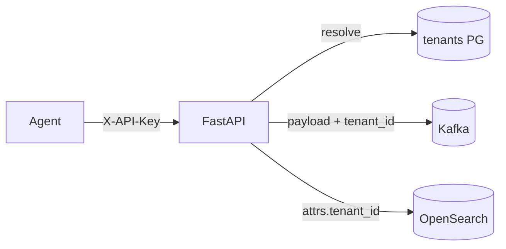

# Phase 6 Architecture — Multi-tenancy & SaaS concerns

Phase 6 turns InsightNode from a single-operator lab into a **multi-tenant** learning SaaS: identify who is calling, isolate their data, limit and meter usage, and understand sharding by tenant.

```
Phase 5:  metrics + logs + traces (three pillars)
Day 1:    Tenant registry + X-API-Key identity          ← YOU ARE HERE
Day 2:    Persist / query by tenant_id (storage isolation)
Day 3:    Per-tenant rate limits (upgrade from machine_id)
Day 4:    Usage metering + simple quotas
Day 5:    Sharding concepts + docs + graduation
```

---

## Current architecture (Day 1)



| Concept | Day 1 meaning |
|---------|----------------|
| Tenant | One customer / org (`tenant_id`) |
| API key | Shared secret in `X-API-Key` header |
| Soft mode | `TENANCY_STRICT=0` → unknown/missing key falls back to `local` |
| Strict mode | `TENANCY_STRICT=1` → missing/invalid key → 401 |

Default seed: `tenant_id=local`, `api_key=dev-local-key` (override via env).

---

## Day 1 lesson — identity before isolation

```
X-API-Key  →  tenants.api_key  →  TenantContext.tenant_id
                                 ↓
                    stamped on Kafka metrics payload
                    stamped on log attrs.tenant_id
```

Without a stable tenant identity you cannot correctly meter, quota, or shard. Day 1 only **identifies**; Day 2 **isolates** storage/query.

---

## Local ops

```bash
docker compose up -d
uvicorn backend.main:app --reload --port 8001

curl http://127.0.0.1:8001/tenants
curl http://127.0.0.1:8001/health   # tenancy_strict, default_tenant_id

# Ingest with API key
curl -X POST "http://127.0.0.1:8001/metrics" \
  -H "Content-Type: application/json" \
  -H "X-API-Key: dev-local-key" \
  -d '{"machine_id":"demo","timestamp":"2026-07-23T12:00:00Z","event_id":"00000000-0000-4000-8000-000000000001","metrics":[{"name":"cpu_usage","value":1,"unit":"%"}]}'

# Agent
export INSIGHTNODE_API_KEY=dev-local-key
python agent/main.py
```

| Variable | Default | Purpose |
|----------|---------|---------|
| `DEFAULT_TENANT_ID` | `local` | Seeded tenant id |
| `DEFAULT_API_KEY` | `dev-local-key` | Seeded / agent key |
| `TENANCY_STRICT` | `0` | Require valid key when `1` |
| `INSIGHTNODE_API_KEY` | `dev-local-key` | Agent header value |

---

## What Day 1 deliberately does not include

- `tenant_id` columns on `metrics` / ClickHouse / OpenSearch mapping → **Day 2**
- Per-tenant rate limits → **Day 3**
- Usage counters / quotas → **Day 4**
- Physical sharding → **Day 5** (concepts + light partition-key design)
