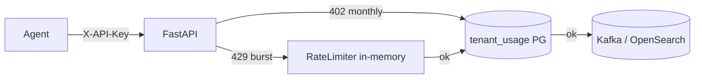

# Phase 6 Architecture — Multi-tenancy & SaaS concerns

Phase 6 turns InsightNode from a single-operator lab into a **multi-tenant** learning SaaS: identify who is calling, isolate their data, limit and meter usage, and understand sharding by tenant.

```
Phase 5:  metrics + logs + traces (three pillars)
Day 1:    Tenant registry + X-API-Key identity
Day 2:    Persist / query by tenant_id (storage isolation)
Day 3:    Per-tenant rate limits (upgrade from machine_id)
Day 4:    Usage metering + simple quotas  ← YOU ARE HERE
Day 5:    Sharding concepts + docs + graduation
```

---

## Current architecture (Day 4)



| Control | Window | HTTP | Store |
|---------|--------|------|-------|
| Rate limit (Day 3) | Sliding seconds | **429** | In-memory |
| Quota (Day 4) | UTC calendar month | **402** | PostgreSQL `tenant_usage` |

### What is counted

| Ingest | Counters |
|--------|----------|
| `POST /metrics` | `metric_events` += 1, `metric_points` += len(metrics) |
| `POST /logs` | `log_events` += len(logs) |

Usage is recorded **after** a successful accept (failed Kafka/OpenSearch is not billed).

---

## Day 4 lesson — throttle ≠ bill

```
429  →  slow down (burst)
402  →  plan exhausted (buy more / wait for next month)
```

| Config | Default |
|--------|---------|
| `QUOTA_METRIC_EVENTS_MONTHLY` | `100000` |
| `QUOTA_LOG_EVENTS_MONTHLY` | `100000` |
| `QUOTA_METRIC_POINTS_MONTHLY` | `500000` |
| `tenants.quota_*` | Optional per-tenant override (`NULL` → env default) |

---

## Local ops

```bash
curl -H "X-API-Key: dev-local-key" http://127.0.0.1:8001/usage

# Lab: tiny quota then burn it
psql "$DATABASE_URL" -c "UPDATE tenants SET quota_metric_events = 3 WHERE tenant_id = 'local';"

# After a few POSTs → 402 Payment Required
curl -H "X-API-Key: dev-local-key" http://127.0.0.1:8001/usage
```

---

## What Day 4 deliberately does not include

- Invoice generation / Stripe billing
- Soft vs hard quotas / overage fees
- Physical sharding → **Day 5**
