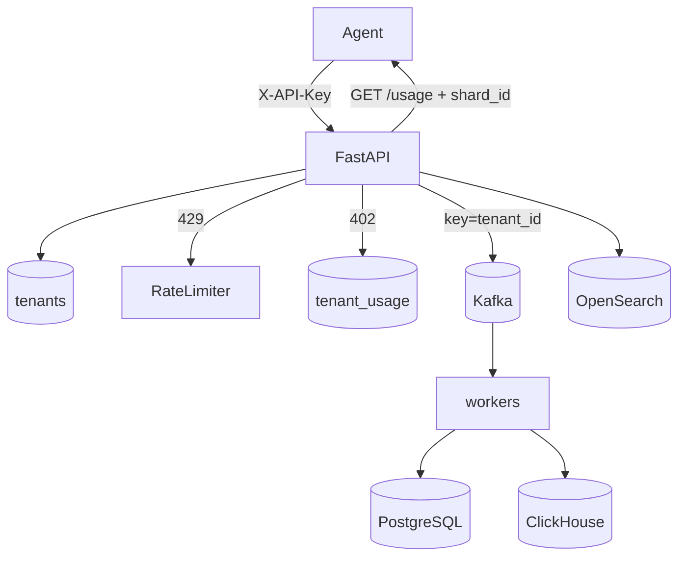

# Phase 6 Architecture — Multi-tenancy & SaaS concerns

Phase 6 turns InsightNode from a single-operator lab into a **multi-tenant** learning SaaS: identify who is calling, isolate their data, limit and meter usage, and understand sharding by tenant.

**Status:** Phase 6 complete (Days 1–5). See [phase-6-graduation.md](phase-6-graduation.md).

```
Day 1:  Tenant registry + X-API-Key identity
Day 2:  Persist / query by tenant_id (storage isolation)
Day 3:  Per-tenant rate limits (upgrade from machine_id)
Day 4:  Usage metering + simple quotas
Day 5:  Sharding concepts + docs + graduation
```

---

## End-state architecture



| Day | Capability |
|-----|------------|
| 1 | `tenants` + `X-API-Key` → `tenant_id` |
| 2 | `tenant_id` on PG / CH / OS; scoped queries |
| 3 | Sliding-window limit per tenant (**429**) |
| 4 | Monthly usage + quotas (**402**); `GET /usage` |
| 5 | Logical `shard_id`; Kafka key = `tenant_id` |

---

## Day 5 lesson — shard by tenant

```
shard_id = crc32(tenant_id) % NUM_SHARDS   # stable, local learning aid
Kafka key = tenant_id                      # partition affinity today
```

| Layer | What InsightNode does | Production next step |
|-------|----------------------|----------------------|
| Kafka | Produce key = `tenant_id` | Same — keeps a tenant on fewer partitions |
| PostgreSQL / CH | Row filter + `ORDER BY` leads with `tenant_id` | Separate DBs / cells per shard range |
| OpenSearch | `tenant_id` keyword filter | Index-per-tenant or routing key |
| API | `GET /usage` → `sharding.shard_id` | Route to the cell that owns that shard |

**Why tenant (not machine)?** Billing, isolation, and support are per customer. A hot machine is a fairness problem; a hot *tenant* is a capacity-planning problem.

`INSIGHTNODE_NUM_SHARDS` (default `4`) configures the logical model only — this repo still runs one local stack.

---

## Controls cheat sheet

| Control | Window | Status | Store |
|---------|--------|--------|-------|
| Rate limit | Seconds | **429** | In-memory |
| Quota | UTC month | **402** | `tenant_usage` |
| Isolation | Forever | filter / 404 | PG / CH / OS |

---

## Local ops

```bash
curl -H "X-API-Key: dev-local-key" http://127.0.0.1:8001/usage
# → usage, quotas, remaining, sharding.shard_id

curl http://127.0.0.1:8001/tenants
```

---

## Deliberately out of scope

- Multi-region cells / Vitess / Citus
- Cross-shard fan-out queries
- Sticky “whale tenant” assignment tables
- Stripe invoices / soft overage billing
