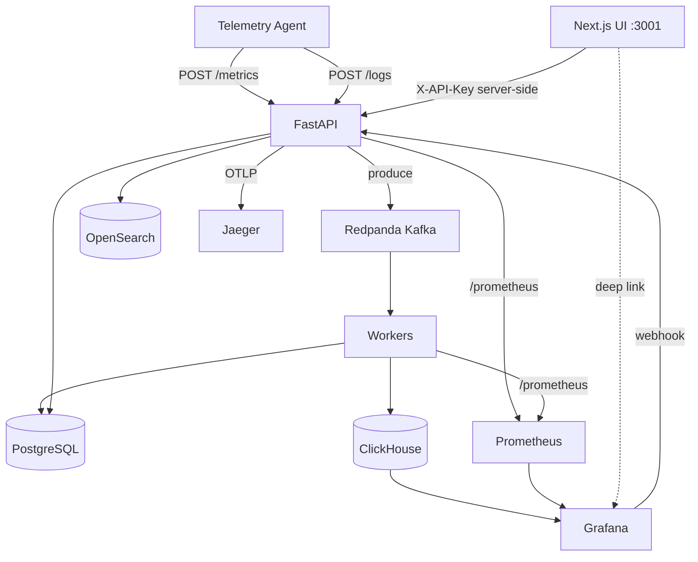

# Phase 7 Architecture — Visualization & product UI

Phase 7 turns the Phase 1–6 data plane into a **usable observability product**: operational dashboards, platform self-metrics, basic alerting, and a thin custom UI for product workflows.

**Status:** Phase 7 complete. See [phase-7-graduation.md](phase-7-graduation.md).

```
Day 1:  Grafana + provisioned ClickHouse / Postgres datasources
Day 2:  Infrastructure Monitoring dashboard (CPU / memory / disk / fleet)
Day 3:  Prometheus + /prometheus instrumentation + Platform dashboard
Day 4:  Grafana alerting → webhook → alert_events (PG)
Day 5:  Host / summary APIs for the product UI
Day 6:  Thin Next.js UI (overview, hosts, alerts, logs, setup)
Day 7:  Fleet simulator + docs + graduation
```

---

## End-state architecture



| Layer | Responsibility |
|-------|----------------|
| **Grafana** | Operational time-series charts, variables, refresh, threshold/no-data alerts |
| **Prometheus** | API/worker process metrics (`/prometheus` — `/metrics` remains ingest) |
| **Custom UI** | Hosts, overview, setup, simplified logs, alert *events* (not rule builder) |
| **PostgreSQL** | Tenants, quotas, raw metrics audit, `alert_events` |
| **ClickHouse** | Metric analytics for Grafana + `/metrics/aggregate` |
| **OpenSearch** | Logs; UI via `/logs/search` |
| **Jaeger** | Distributed traces (unchanged from Phase 5) |

---

## Design principles

1. **Do not rebuild Grafana** in React — deep-link for charts.
2. **Grafana-first alerting** — rules evaluated in Grafana; InsightNode stores events for the product UI.
3. **Hosts are derived** from metric streams (`machine_id` + `last_seen`) — no mandatory registry table.
4. **Secrets stay server-side** — UI uses `INSIGHTNODE_API_KEY` only in Next.js server env.
5. **Lab defaults are fine locally** — never treat `dev-local-key` / compose passwords as production secrets.

---

## Key URLs (local)

| Surface | URL |
|---------|-----|
| Custom UI | http://localhost:3001 |
| Grafana | http://localhost:3000 (`admin` / env password) |
| Infrastructure dashboard | http://localhost:3000/d/insightnode-infrastructure |
| Platform dashboard | http://localhost:3000/d/insightnode-platform |
| Prometheus | http://localhost:9090 |
| Jaeger | http://localhost:16686 |
| API docs | http://127.0.0.1:8001/docs |

---

## New / extended APIs (Phase 7)

| Method | Path | Role |
|--------|------|------|
| `GET` | `/prometheus` | Prometheus scrape (API) |
| `GET` | `/hosts` | Fleet inventory from ClickHouse |
| `GET` | `/hosts/{machine_id}` | Host detail + warn logs + Grafana URL |
| `GET` | `/system/summary` | Overview cards |
| `GET` | `/alert-events` | List firing/resolved events |
| `POST` | `/alert-events/webhook` | Grafana contact point (Bearer secret) |

Worker exposes the same Prometheus text format on `WORKER_METRICS_PORT` (default `8002`).

---

## Provisioning layout

```
infrastructure/
  grafana/
    provisioning/
      datasources/
      dashboards/
      alerting/
    dashboards/
      infrastructure.json
      platform.json
  prometheus/
    prometheus.yml
frontend/                 # Next.js thin UI
```

Clone → `docker compose up` → datasources and dashboards load without manual Grafana clicks.

---

## What Phase 7 deliberately does not include

- Custom dashboard builder
- Full Grafana chart clone in the UI
- Custom alert-rule CRUD evaluator (rules stay in Grafana for MVP)
- OpenSearch Dashboards (deferred; simplified `/logs` is enough)
- Kubernetes / microservices split for appearance
- Production auth/SSO

---

## Related docs

- [phase-7-graduation.md](phase-7-graduation.md)
- [interview-questions.md](interview-questions.md)
- [cloud-readiness.md](cloud-readiness.md)
- [screenshots/README.md](screenshots/README.md)
- [bottlenecks-and-roadmap.md](bottlenecks-and-roadmap.md)
