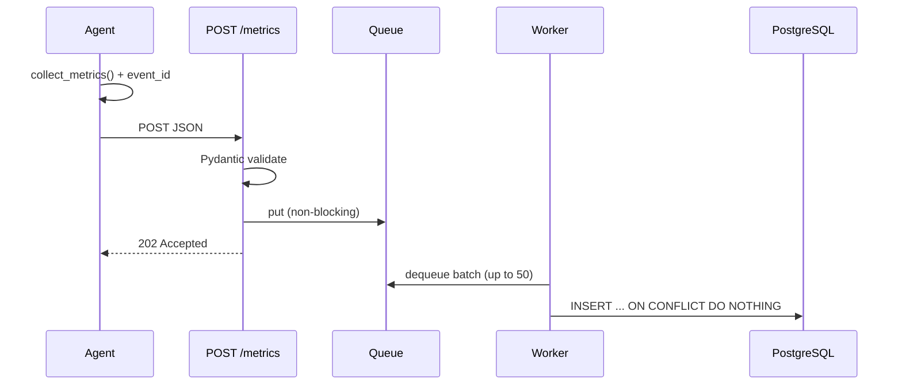
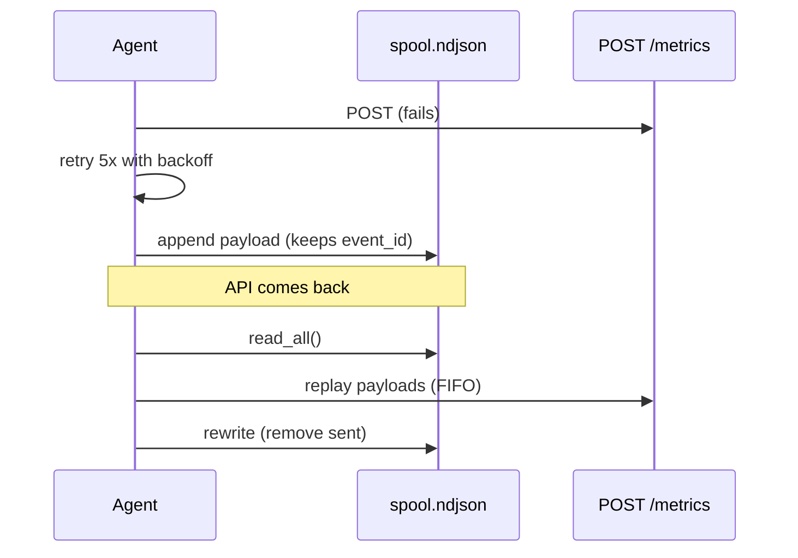
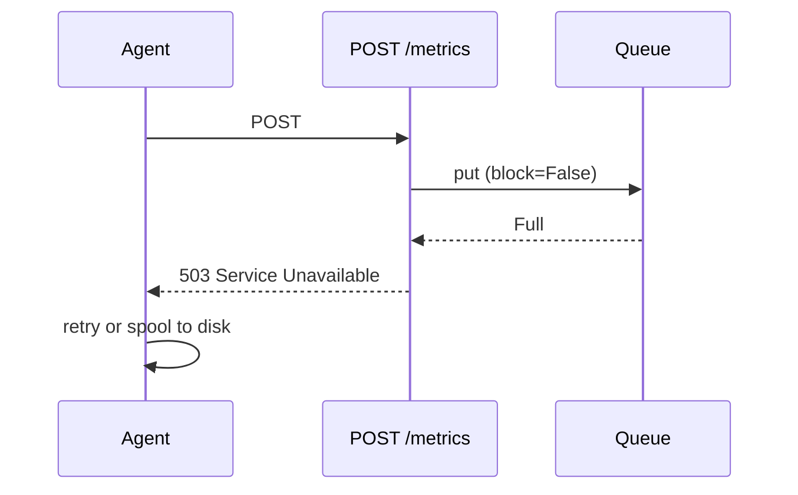
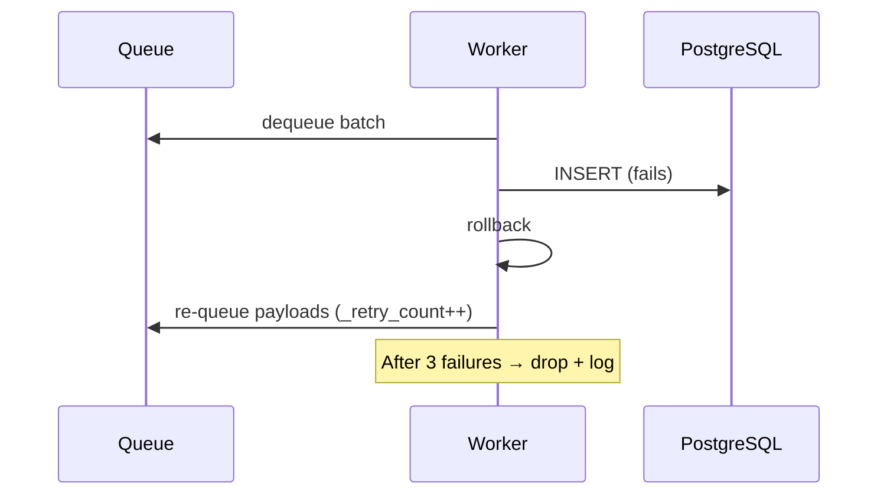
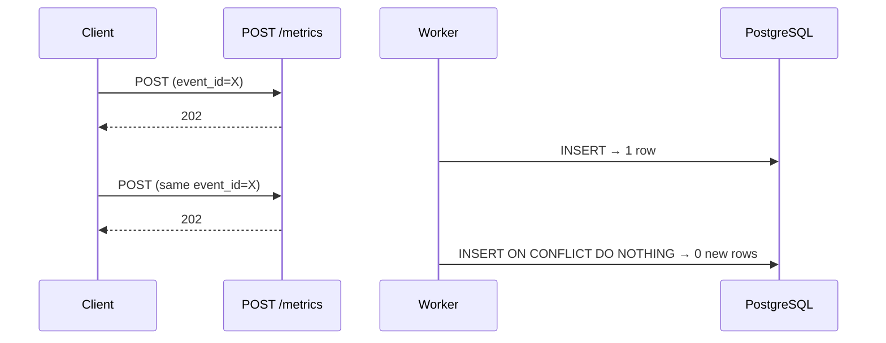

# Request Flows (Phase 1)

Five flows that cover normal operation and failure modes in InsightNode.

---

## 1. Happy path — ingest

| Step | Failure | Effect |
|------|---------|--------|
| POST | Network error | Agent retries, then spools |
| Enqueue | Queue full | API returns 503; agent retries/spools |
| Worker INSERT | DB down | Batch re-queued (max 3 attempts) |

---

## 2. API unreachable — agent spool

**Key:** `event_id` in the spooled payload ensures replay does not create duplicate DB rows.

---

## 3. Queue full — backpressure

**Why `block=False`:** HTTP threads must not hang indefinitely. Backpressure is pushed to the agent.

---

## 4. PostgreSQL down — worker retry

---

## 5. Duplicate POST — idempotent storage

**Capstone result (2026-07-10):** Two identical POSTs with `event_id=aaaaaaaa-bbbb-cccc-dddd-eeeeeeeeeeee` → `COUNT(*) = 1` in database.

---

## Query flows

### Raw query — `GET /metrics`

Filter by `machine_id`, `metric_name`, `start_time`, `end_time`, `limit`. Returns individual samples.

### Aggregate query — `GET /metrics/aggregate`

Requires `machine_id`, `metric_name`, `start_time`, `end_time`. Groups by `date_bin(interval, timestamp)` and returns avg, min, max, sample_count per bucket.
