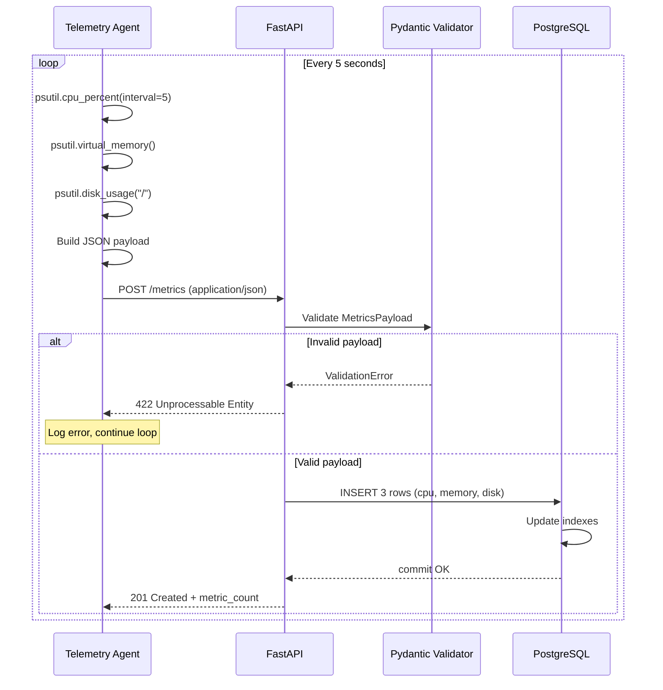
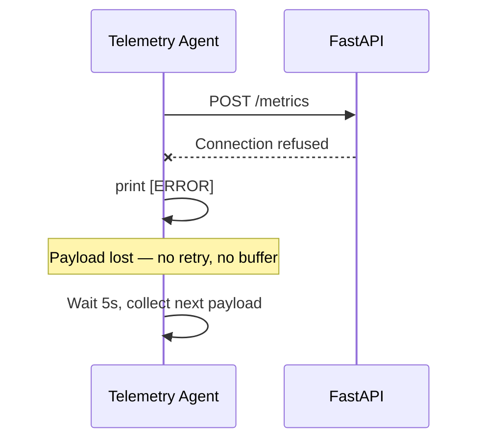
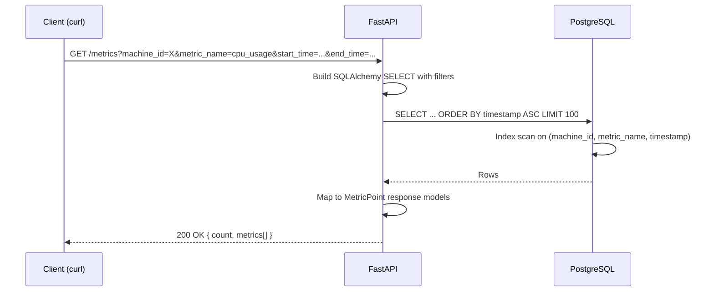
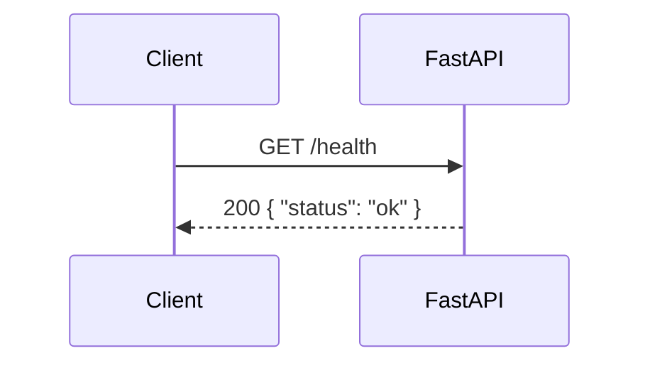

# Request Flows — Phase 1

## 1. Metric ingestion flow (POST /metrics)

This is the **write path** — runs every 5 seconds per agent.



### Step-by-step

| Step | Component | What happens |
|------|-----------|--------------|
| 1 | Agent | Block ~5s while sampling CPU |
| 2 | Agent | Read memory and disk (instant) |
| 3 | Agent | Build payload with UTC timestamp |
| 4 | Agent | `httpx.post()` — **waits for response** |
| 5 | API | Pydantic validates schema |
| 6 | API | Create 3 `MetricRecord` ORM objects |
| 7 | API | `db.add_all()` + `db.commit()` — **blocks until disk write** |
| 8 | API | Return `{ status, machine_id, metric_count }` |

### Failure: backend down



**Observed behavior:** `[ERROR] Failed to send metrics: [Errno 61] Connection refused`

---

## 2. Metric query flow (GET /metrics)

This is the **read path** — used by curl, Swagger UI, future dashboards.



### Query parameters

| Parameter | Required | Purpose |
|-----------|----------|---------|
| `machine_id` | No | Filter to one host |
| `metric_name` | No | Filter to one metric (e.g. `cpu_usage`) |
| `start_time` | No | Inclusive lower bound (ISO 8601) |
| `end_time` | No | Inclusive upper bound (ISO 8601) |
| `limit` | No (default 100) | Max rows returned (1–1000) |

### Example requests

```bash
# Latest metrics (up to 100 rows)
curl "http://127.0.0.1:8000/metrics"

# CPU only for one machine
curl "http://127.0.0.1:8000/metrics?machine_id=Jayakrishnans-MacBook-Air.local&metric_name=cpu_usage"

# Time range (URL-encode timestamps with +)
curl -G "http://127.0.0.1:8000/metrics" \
  --data-urlencode "metric_name=cpu_usage" \
  --data-urlencode "start_time=2026-06-14T19:00:00+00:00" \
  --data-urlencode "end_time=2026-06-14T20:00:00+00:00"
```

---

## 3. Health check flow (GET /health)



**Note:** `/health` does not check PostgreSQL connectivity today. A "deep" health check (`/health/ready`) that pings the DB is a future improvement.

---

## 4. Payload contract (POST /metrics)

### Request body

```json
{
  "machine_id": "Jayakrishnans-MacBook-Air.local",
  "timestamp": "2026-06-14T19:33:54.706344+00:00",
  "metrics": [
    { "name": "cpu_usage",    "value": 37.7, "unit": "percent" },
    { "name": "memory_usage", "value": 79.7, "unit": "percent" },
    { "name": "disk_usage",   "value": 37.7, "unit": "percent" }
  ]
}
```

### Success response (201)

```json
{
  "status": "accepted",
  "machine_id": "Jayakrishnans-MacBook-Air.local",
  "metric_count": 3
}
```

### Validation error (422)

Returned when required fields missing, empty `metrics` array, or invalid types.

---

## 5. Query response contract (GET /metrics)

```json
{
  "count": 2,
  "metrics": [
    {
      "machine_id": "Jayakrishnans-MacBook-Air.local",
      "metric_name": "cpu_usage",
      "value": 17.2,
      "unit": "percent",
      "timestamp": "2026-06-14T19:37:05.020857+00:00"
    }
  ]
}
```

Results ordered **oldest first** (`timestamp ASC`) — suitable for time-series charts left-to-right.
